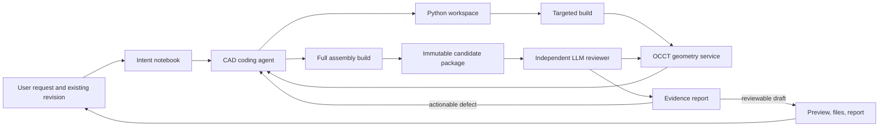

# Forma — AI-Native, Code-First CAD Architecture

**Prepared:** September 2026  
**Status:** Architecture proposal based on the current codebase, the deep-research brief, and the enclosure, motor-bracket, pedal-box, gearbox, valve, suspension, and bearing tests.

## 1. Decision

Forma will remain a conversational, human-reviewed CAD copilot whose editable source of truth is Python code, parameters, semantic references, and assembly definitions.

The current fixed outer lifecycle may remain for durability, ownership, cancellation, and publication. The CAD work inside that lifecycle will change from a one-shot structured generation step into an agentic coding session:

```text
understand intent
→ inspect project
→ plan parts and features
→ write a small change
→ build the affected target
→ interrogate the resulting geometry
→ repair or continue
→ build the complete assembly
→ independent AI review using read-only geometry tools
→ repair when useful
→ publish a reviewable draft with evidence and known gaps
```

Forma will not hardcode a validator type for every possible mechanical domain. Instead, it will provide generic, deterministic geometry operations that the CAD agent and an independent reviewer can compose for the current request.

Only universal integrity and security conditions are hard gates. Design requirements are evidence-backed findings presented to the user; they do not pretend to be certification.

## 2. What “AI-native” means here

AI-native does not mean trusting model prose. It means the model controls the design process through code and tools instead of being forced through a fixed catalog of CAD cases.

The model may:

- Decide which components and subassemblies are needed.
- Choose CadQuery, supported helper functions, or direct OCP operations.
- Edit one feature, component, or subassembly at a time.
- Execute a targeted build before completing the entire project.
- Ask general geometry questions about the built result.
- Write request-specific inspection programs against a read-only inspection API.
- Call engineering calculation capabilities when the design needs them.
- Ask the user only when an unresolved choice materially changes the design.
- Use measured reviewer findings to repair its own source.

The model may not:

- Mark its own unmeasured claim as verified.
- Change the original user request or accepted assumptions.
- Replace a failed candidate with a simpler design without reporting that change.
- Write to the independent reviewer’s evidence store.
- bypass sandbox, credential, ownership, artifact-integrity, or stale-candidate checks.

## 3. Rigidity to remove and invariants to keep

### Remove from the CAD decision path

- The fixed requirement enum containing only dimensions, center, solid count, holes, and corner radius.
- Keyword-based component binding and axis inference.
- One complete multi-file candidate in one model tool response.
- Mandatory engineering calculation and approval for every request routed to analysis.
- Automatic publication immediately after a readable STEP build.
- Repair triggered only by Python or export failure.
- Silent assembly-hierarchy flattening.
- A universal fixed count of three repair attempts for every design complexity.

### Keep as hard invariants

- Generated code runs only in an isolated sandbox.
- The sandbox contains no application credentials and has no network access.
- Source paths remain workspace-relative and protected from traversal.
- Every external operation remains idempotent and associated with a candidate hash.
- A candidate cannot reuse artifacts from a different source, runtime, or inspection identity.
- Null, unreadable, corrupt, non-finite, and invalid BRep outputs cannot be published.
- A failed candidate never replaces the previous successful revision.
- The original user request, accepted clarifications, and engineering assumptions remain immutable inputs to review.
- The user remains the final design reviewer.

These invariants protect the product. They do not prescribe what a bearing, valve, gearbox, enclosure, or future design must look like.

## 4. Proposed system



### 4.1 Intent notebook

The first model turn creates a compact design notebook rather than a strict requirement contract. It always retains the original request verbatim and adds:

- User-visible design objective.
- Accepted clarifications and assumptions.
- Component and part-type inventory.
- Important dimensions, materials, and manufacturing intent.
- Relationships that appear important: contact, clearance, alignment, containment, motion, load path, or appearance.
- Open questions and decisions the agent can reasonably make.
- A provisional work plan.

The notebook is editable by the agent as knowledge improves, but changes are recorded. The original request is never replaced.

No fixed domain enum is required. Stable statement IDs allow the reviewer to attach evidence later.

### 4.2 Code-first project package

Each project remains a real Python workspace:

```text
project/
  design.py                 # project entry point and dependency graph
  parameters.py             # named user/design parameters
  parts/                    # independently buildable part definitions
  assemblies/               # instances, joints, and configurations
  inspections/              # request-specific read-only inspection programs
  intent/                    # original request, assumptions, and reviewer findings
  project.lock              # supported runtime and dependency versions
```

Every part returns a `DesignPart` object:

```python
DesignPart(
    shape=body,
    name="outer_race",
    material="bearing_steel",
    references={
        "axis": Axis(...),
        "raceway_centerline": Circle(...),
        "left_face": Plane(...),
    },
    feature_log=[...],
)
```

Every assembly returns a `DesignAssembly` object containing:

- Component definitions and reusable instances.
- Named local coordinate systems.
- Joints or relationships between semantic references.
- Named configurations or poses.
- Material assignments when known.
- A stable identity for each definition and instance.

References are semantic names created in code. Persistent face numbers are never the project contract.

### 4.3 Trusted Forma CAD library

Generated source may use CadQuery directly, but Forma also provides reviewed helpers built on CadQuery and OCP:

```text
checked_cut
checked_fuse
checked_shell
checked_sweep
checked_loft
make_raceway
make_socket
make_keyway
make_pocket
make_groove
make_fastener_instance
```

Each operation records:

- Input and output shape identity.
- Operation parameters and units.
- Before/after volume and solid count.
- BRep validity.
- Generated semantic references.
- Warnings such as an empty cut, disconnected result, or unexpectedly unchanged volume.

The helpers improve common operations without limiting the model to templates. Direct OCP remains available for geometry outside the helper library.

### 4.4 Generic geometry service

The geometry service runs trusted OCCT/OCP code against built artifacts. It exposes general questions instead of product-specific pass/fail validators:

```text
describe_shape(target)
list_components(assembly)
list_solids(target)
list_surfaces(target, optional_type)
resolve_reference(component, name)
measure_bounds(target)
measure_mass(target, material)
measure_axis(reference)
measure_distance(a, b)
measure_angle(a, b)
measure_intersection(a, b)
measure_wall_thickness(target, region)
measure_radial_clearance(a, b, axis)
check_containment(inner, outer)
check_connectivity(target)
apply_configuration(assembly, configuration)
render_view(target, camera, section_planes)
compare_builds(old, new)
```

Every response contains:

- Candidate hash and runtime hash.
- Exact or tessellated method.
- Inputs and resolved component/reference IDs.
- Numeric result and units.
- Tolerance used by the kernel.
- Diagnostic geometry such as contact points, intersection volume, or closest points.

The service does not decide which dimensions matter. The agent or reviewer decides what to ask based on the user’s request.

### 4.5 Targeted builds

The CAD agent no longer has to generate the entire assembly before getting feedback. It can request:

- One feature experiment.
- One component build.
- A subset of dependencies.
- A subassembly.
- A named configuration.
- The complete project.

Build results are cached by source, parameter, dependency, and runtime hashes. A component edit invalidates that component and its ancestors, not unrelated parts.

This shortens the loop and reduces the tendency to produce placeholder geometry simply to finish a large response.

## 5. Independent LLM reviewer

The reviewer is a separate agent role with read-only access to:

- Original request and accepted clarification.
- Engineering notebook.
- Final source tree and feature log.
- Imported STEP/XDE component tree.
- Generic geometry tools.
- Renders and sectional views.
- Prior findings and repair results.

The reviewer cannot edit CAD source or publish a revision.

### Review procedure

1. Extract a claim ledger from the original request without forcing claims into a fixed type enum.
2. Decide which claims can be inspected geometrically, which need engineering calculations, and which require human or physical validation.
3. Compose geometry queries or write a read-only inspection program using the trusted API.
4. Examine renders and section views for missing features and implausible topology.
5. Attach evidence to each claim.
6. Return actionable findings to the CAD agent when another repair is likely to improve the candidate.
7. Produce the user report when the candidate is reviewable or further automatic work is not useful.

### Evidence states

The reviewer uses descriptive states rather than a global certification result:

- `observed_match` — measured result agrees with the requested value within the stated tolerance.
- `observed_mismatch` — measured result conflicts with the request.
- `present_unquantified` — the feature is visible or topologically present but was not fully measured.
- `not_observed` — requested feature could not be found.
- `not_checked` — no suitable inspection was run.
- `requires_engineering` — needs calculation, material data, simulation, or a domain decision.
- `requires_physical_validation` — sealing, fatigue, feel, life, impact, manufacturing process, and similar real-world claims.

The reviewer may recommend repair, but it does not turn uncertain evidence into a pass.

### Reviewer model configuration

- Reviewer model inherits the active CAD model by default.
- Admin may assign a separate OpenRouter model ID and key.
- Arbitrary OpenRouter model IDs remain supported.
- If the reviewer model is unavailable, the draft remains accessible with deterministic integrity evidence and `review unavailable` status.

## 6. Repair policy without a rigid domain gate

Repair is driven by findings rather than only exceptions.

Examples:

```text
not_observed: outer_race.raceway
observed_mismatch: ball_03-to-inner_race radial gap = -2.247 mm, expected +0.005 to +0.020 mm
observed_mismatch: output_gear intersects housing by 51,436 mm³
observed_mismatch: cage has 8 connected solids, intended one-piece cage
```

The CAD agent chooses whether to:

- Modify an existing operation.
- Add a missing cut or feature.
- Re-plan a component.
- Modify an assembly placement.
- Request an engineering calculation.
- Ask the user about an ambiguity.
- Stop automatic repair and show the best draft with the known issue.

Resource budgets remain configurable, but they are not expressed as “all designs receive three attempts.” The design session receives a time/cost envelope. Within it, the agent can perform many inexpensive inspections and targeted builds while reserving full rebuilds and model calls for meaningful changes.

The loop stops when:

- The reviewer finds no actionable mismatch within the requested scope.
- The next repair would require a user decision.
- The same measured defect and candidate hash repeat.
- The agent determines the remaining issue needs unsupported physics or a human decision.
- The configured time/cost envelope is reached.

In every case, a readable draft may be offered with explicit findings. Corrupt or stale artifacts remain blocked.

## 7. Open-source foundation

### OCCT/OCP: geometry authority

Use OCCT for exact BRep construction and inspection, Boolean intersection/cut/fuse, shape validity, distances, mass properties, surface classification, STEP/XDE, and semantic assembly data. OCAF/XCAF can preserve an assembly/product tree with attributes, materials, validation properties, and data-exchange metadata.

OCCT answers whether the exported geometry actually contains the intended topology. It replaces neither the CAD model nor the reviewer; it supplies trustworthy measurements.

### CadQuery: initial generated source language

Keep CadQuery because the existing project, runtime, prompts, and generated sources already use it. Improve its use through the Forma helper library and direct OCP inspection.

### build123d: selective authoring and joint experiments

Evaluate build123d for new feature helpers, topology selection, locations, and joint-based assemblies. Do not perform a wholesale migration until the exact validator is stable; CadQuery and build123d both depend on OCCT.

### OCAF/XDE: product structure and exchange

Use XDE for STEP assembly definitions, instances, names, colors, materials, and metadata. Keep Python code as the editable source, while XDE becomes the authoritative derived exchange document.

### FCL: optional acceleration

For large assemblies and motion ranges, use FCL for broad-phase collision candidates and continuous collision screening. Confirm reported tight clearances with exact OCCT operations.

### FreeCAD Assembly / Ondsel solver: optional constraint adapter

Study or adapt its joint-solving concepts for rigid, revolute, cylindrical, slider, ball, distance, angle, and gear relationships. Do not package the complete FreeCAD desktop application into the first Vercel runtime. A solver adapter should be evaluated separately after the semantic assembly contract exists.

## 8. How this closes the test failures

| Test | Current failure | AI-native response |
|---|---|---|
| Enclosure | PCB clips cable gland | Reviewer asks for exact intersection of internal components and returns the colliding pair and volume |
| Motor bracket | Engineering gate and assumptions interrupted design | Engineering becomes callable; analysis evidence is attached without blocking exploratory CAD |
| Pedal box | Static placement, collisions, wrong envelope | Assembly defines revolute joints and 0°/25° configurations; reviewer checks exact collisions in both |
| Gearbox | Correct center distance but gears embedded in housing | Reviewer measures gear axes and body intersections; `checked_cut` records whether the cavity removed material |
| Valve | Correct concurrency but outlet intersects body | Reviewer measures concurrency and separately checks the port/body Boolean relief in both configurations |
| Suspension | Correct compound angle but joint embedded | Reviewer resolves joint/socket references and measures containment and intersection |
| Bearing | Correct PCD numbers but no raceways, buried balls, split cage | Surface inspection finds missing toroidal raceways; clearance queries expose negative gaps; connectivity check finds eight cage solids |

## 9. Closing the workflow gap with SolidWorks and CATIA

Forma cannot reproduce the full maturity of SolidWorks or CATIA in one release. It can close the architectural gaps that currently prevent users from treating generated work as an editable CAD project.

| Professional CAD capability | Forma equivalent |
|---|---|
| Parametric feature history | Python construction code plus feature log and dependency hashes |
| Reference planes, axes, and coordinate systems | Named semantic references returned by each part |
| Assembly mates and mechanisms | Joint objects between semantic references, with named configurations |
| Configurations/design states | Parameter sets and pose definitions committed with the revision |
| Rebuild propagation | Dependency-aware targeted build cache |
| Part versus instance identity | Stable definition/instance IDs preserved through XDE and preview |
| Interference and clearance tools | LLM-composed OCCT queries, with optional FCL broad phase |
| Mass properties | OCCT properties combined with explicit material density |
| Section inspection | Server-rendered section views available to the agent, reviewer, and user |
| Surface construction | CadQuery/build123d/direct OCP loft, sweep, fill, trim, offset, thicken, and NURBS operations |
| Surface quality analysis | Future curvature, continuity, draft, and reflection-line inspection tools |
| Undo and revisions | Immutable code snapshots and derived artifact identities |

The near-term target is not full UI parity. It is an AI-managed parametric model with stable references, editable code history, assembly joints, configurations, evidence-backed inspection, and interoperable STEP output.

Drawings, CAM, production FEA/CFD, advanced sheet-metal flattening, tolerance-stack certification, Class-A styling workflows, and vendor-specific native formats remain future specialist capabilities.

## 10. Data and tool contracts

### Candidate package

```text
candidate_id
source_hash
runtime_hash
parent_revision_id
changed_targets
component definitions
instances
semantic references
joints
configurations
materials
feature-operation log
STEP/XDE artifacts
preview artifacts
```

### Measurement evidence

```text
evidence_id
candidate_id
query source
method: exact_brep | tessellated | visual | calculation
input component/reference IDs
configuration ID
numeric values and units
kernel tolerance
diagnostic artifact IDs
runtime version
```

### Reviewer finding

```text
finding_id
statement_id
status
severity
evidence_ids
plain-language explanation
repair instruction
remaining uncertainty
```

These are infrastructure contracts. They are open-ended and do not enumerate every possible mechanical requirement.

## 11. User-visible behavior

After generation, the user sees:

- The generated part or assembly immediately when it is buildable.
- A concise design summary.
- Component tree and named configurations.
- Known geometry findings and their affected components.
- Which requested statements were observed, mismatched, not checked, or require physical validation.
- Section or collision overlays for important issues.
- Edit and Continue actions that preserve the current candidate context.
- Download access for buildable artifacts, with clear draft status.

The UI does not show internal chain-of-thought or generated source unless a future developer mode is explicitly added.

## 12. Migration sequence

### Stage 1 — Generic geometry interrogation

- Add OCCT read-only inspection operations and immutable measurement evidence.
- Add exact intersection, distance, connectivity, surface classification, and component-tree inspection.
- Keep current generation and publication behavior while displaying stronger evidence.

### Stage 2 — Incremental CAD coding session

- Replace one-shot `Candidate` generation with workspace read/patch/targeted-build/inspect tools.
- Preserve model context across tool turns.
- Cache components and rebuild affected dependencies.

### Stage 3 — Independent reviewer

- Add a read-only reviewer role that composes checks from the original request.
- Feed actionable findings into CAD repair.
- Replace the fixed requirement enum in the critical path with the statement/evidence model.

### Stage 4 — Semantic parts and assemblies

- Add named references, definitions versus instances, joints, configurations, and XDE export.
- Remove keyword-based axis/component binding and silent hierarchy flattening.

### Stage 5 — Professional CAD depth

- Expand surfacing inspection, engineering coupling, design tables/configurations, purchased-part imports, and specialist runtimes.
- Add optional motion broad phase and a constraint-solver adapter after profiling.

## 13. Acceptance criteria

The architecture is successful when:

- A simple plate can be created and edited without invoking unnecessary engineering gates.
- A 20-plus-instance assembly can be developed incrementally without returning its entire workspace in one model response.
- The gearbox case detects embedded gears and missing keyways.
- The bearing case detects missing raceways, negative ball clearance, and a disconnected cage.
- The pedal box checks both named angular configurations and identifies colliding parts.
- The valve checks both flow positions and distinguishes axis concurrency from body interference.
- The suspension design distinguishes correct orientation from incorrect socket clearance.
- The reviewer can add a new request-specific inspection without changing the backend requirement enum.
- Unavailable or inconclusive checks remain visible as uncertainty rather than causing a false pass or preventing access to a usable draft.
- Corrupt, stale, or invalid CAD artifacts remain impossible to publish.
- Component and instance identities survive STEP/XDE export and frontend selection.

## 14. Final architectural rule

> The LLM decides what to design and what to inspect. Generated Python defines the editable design. OCCT provides measured geometric facts. A separate LLM reviewer connects those facts back to the user’s request. The user decides whether the draft is acceptable.

This preserves an open-ended AI workflow while closing the failures discovered during testing.
