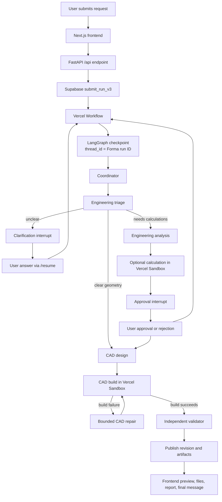

# Forma / GenDesign CAD Copilot — Deep Research Brief

**Prepared:** September 2026  
**Purpose:** Give a researcher enough context to study the product, its current capabilities, and the technical gaps that prevent reliable assembly generation.

## 1. What we are building

Forma (also called GenDesign in some test records) is a conversational CAD and engineering copilot.

A user describes a part, assembly, or engineering problem in natural language. Forma should:

1. Understand the request and identify missing information.
2. Ask focused clarification questions when necessary.
3. Perform engineering calculations when loads, materials, safety factors, tolerances, or other assumptions require them.
4. Generate CadQuery Python source for the requested parts and assembly.
5. Build the source in an isolated CAD runtime.
6. Produce STEP and GLB files plus an assembly tree.
7. Show progress, calculations, files, and a 3D preview in the frontend.
8. Let the user review, edit, regenerate, and download the result.

Forma is positioned as a **human-reviewed design copilot**, not a certification or production safety system. The user owns the final review and can download or edit the generated design.

The product must support:

- Simple single parts
- Dimensioned plates and brackets
- Engineering-driven designs
- Multi-part assemblies
- Reused part instances and fasteners
- Assemblies with axes, contacts, fits, motion positions, and internal clearances

The design goal is not merely to create a valid-looking picture. The goal is to produce a buildable CAD candidate that is as close as possible to the explicit request, with honest evidence for what was and was not checked.

## 2. Product boundaries and constraints

Current product decisions:

- Frontend remains Next.js and React.
- Backend is Python FastAPI, not a TypeScript backend.
- LangGraph is the source of truth for graph state and checkpoints.
- Vercel Workflow is retained as the lightweight cloud runner that starts and advances bounded graph transitions.
- Vercel Sandbox is the hosted CAD execution environment.
- Supabase remains the hosted authentication, database, and private-storage provider.
- OpenRouter remains the model provider adapter. Arbitrary OpenRouter model IDs should be accepted.
- LangSmith replaces MLflow for tracing.
- No Docker, local MLflow server, new queue, worker service, or separate LangGraph hosting platform should be introduced.
- Paid inference can be enabled by the user, but model choice should not be restricted to a fixed free-model list.
- Existing testing data may be discarded; accounts, projects, revisions, artifacts, and model credentials should be preserved where practical.

Production frontend:

`https://forma-cad-eosin.vercel.app/`

Supabase project:

`bisbakbhybkhcjztqnag`

No secrets, API keys, database passwords, or access tokens belong in this document.

## 3. Current production architecture



### 3.1 Frontend

The frontend provides:

- Project selection
- Conversational chat
- Run activity events
- Workspace collapse/reopen controls
- 3D preview
- Component tree and selection
- Files tab with STEP/GLB downloads
- Calculations tab
- Revision history
- Settings and model configuration
- A collapsed **Automated evidence** section for validation results

The frontend receives workspace data from the Python API. It should not hold backend credentials, execute CAD code, call OpenRouter directly, or access Supabase with server secrets.

### 3.2 Python API

The FastAPI service owns:

- Authentication and ownership checks
- Projects and revisions
- Chat submission
- Run status and events
- Resume, approval, rejection, continue, and cancellation routes
- Model configuration
- OpenRouter calls
- LangGraph graph construction and invocation
- CAD execution orchestration
- Artifact publication
- Administrative settings

The API uses Supabase REST/RPC for application data and a server-only Supabase transaction-pooler URL for LangGraph PostgreSQL checkpoint storage.

### 3.3 LangGraph

The fixed graph currently has these logical nodes:

`coordinator → engineering_triage → clarification | engineering_analysis → approval → cad_design → build → validate → repair | publish → final`

LangGraph state includes request identity, graph phase, engineering assumptions, requirements, candidate hashes, build results, validation evidence, repair history, model usage, and operation identities.

Human pauses use LangGraph interrupts. The API resumes the same thread using the Forma run ID as `thread_id`.

### 3.4 Vercel Workflow

Vercel Workflow is only a durable scheduler and bounded cloud runner. It:

- Starts after a request is submitted.
- Invokes one bounded graph transition at a time.
- Retries scheduling or process interruption.
- Exits when LangGraph reaches an interrupt or terminal state.
- Starts a new invocation after the user answers or approves.

It is not a second checkpoint store and must not contain the business state of the graph.

### 3.5 CAD runtime and validator

Generated Python never runs inside the API process. It runs in a Vercel Sandbox with:

- Pinned CadQuery dependencies
- A protected runtime
- No network access
- No application credentials
- Restricted generated-code permissions
- A clean workspace and output directory per attempt

The build creates STEP and GLB artifacts. A separate validator process reopens exported STEP files and writes `report.json`.

The validator currently supports only these requirement kinds:

- `dimensions`
- `center`
- `solid_count`
- `through_holes`
- `corner_radius`
- Explicit `unverified`

The validator is independent because it reads the exported CAD result rather than trusting the CAD agent's source comments or natural-language claim.

## 4. What the product can deliver today

Forma currently delivers these capabilities reasonably well:

- Natural-language request intake
- Engineering triage and routing
- Clarification and approval interrupts
- LangGraph checkpoint persistence and resume
- Vercel Workflow execution
- OpenRouter model selection
- CAD source generation
- CadQuery execution in an isolated hosted environment
- STEP and GLB exports
- Assembly manifests with component definitions and instances
- Shared fastener/part definitions with multiple placements
- Basic artifact storage and downloads
- Run activity events
- Basic dimensions, center, solid count, hole, and corner-radius checks
- Revision publication for human review
- LangSmith tracing configuration

Independent review of several generated assemblies also indicates that placement calculations are often numerically good:

- Ball positions at exact 45-degree intervals
- Gear center distances constructed at 40 mm and 48 mm
- Three-way valve port axes placed through a common point
- Compound-angle direction vector composed correctly for the suspension test

These are placement observations, not a claim that the complete assemblies are correct.

## 5. What the product cannot reliably deliver yet

The system does not yet reliably guarantee:

- Internal cavities and pockets that correctly make room for nested parts
- Raceway grooves and toroidal surfaces
- Sockets and press-fit interfaces
- Pairwise interference-free assemblies
- Contact and tangency at curved surfaces
- Minimum and maximum clearances
- Motion-state collision checks
- Axis concurrency and cross-part concentricity checks
- Gear center-distance verification from imported geometry
- Tolerance stack-up verification
- One-piece topology verification
- Mass calculation with assigned density
- Complete engineering evidence for every explicit requirement
- Semantic repair after a geometrically wrong but buildable candidate

The current product can therefore produce a plausible, editable CAD draft, but it cannot yet consistently produce a geometrically compliant assembly.

## 6. Observed test evidence

The following tests were run through the production pipeline. The counts below come from stored revisions and validation reports.

| Test | Stored geometry result | Requirement evidence | Key observation |
|---|---|---|---|
| Pedal box assembly | 23 manifest instances; exported assembly measured 32 solids; envelope `220 × 160 × 229 mm` | 1 passed, 17 unverified | Independent audit found brake/accelerator pad collision, arm/bracket overlap, and spring/arm overlap |
| Two-stage gearbox | 31 solids; envelope `190 × 120 × 94 mm` | 0 passed, 15 unverified | Independent audit found gears almost completely embedded in housing, shafts embedded, and two keyways missing |
| Three-way ball valve | 29 solids; envelope `180 × 106 × 113 mm` | 0 passed, 10 unverified | Independent audit found interference at the perpendicular outlet; port concurrency was numerically correct |
| Suspension strut/control arm | 15 solids; envelope `261.73 × 114.07 × 175.74 mm` | 0 passed, 1 failed, 10 unverified | Envelope exceeded the 260 mm X limit; independent audit found ball joint embedded in arm and knuckle |
| Deep-groove bearing | 13 manifest instances; exported assembly measured 20 solids | Envelope passed; solid count failed; remaining checks unverified | Independent audit found no raceway grooves, 2.25 mm ball interference, and an 8-solid cage |
| IoT enclosure | Separate historical audit | Not in the current production revision set | Independent audit found a minor PCB/cable-gland overlap |
| Motor bracket and plate | Separate historical run | Not independently rerun in the latest audit | Used earlier to test basic dimensions and engineering calculations |

### 6.1 Pedal box

The requirement listed 23 total instances, and the manifest contained 23 instances. However, the root exported STEP geometry contained 32 solids. This distinction matters: a manifest instance is not necessarily one BRep solid.

The independent audit found:

- Brake and accelerator pads physically colliding
- Arm-to-bracket overlap
- Spring-to-arm overlap
- Z-envelope of 229 mm versus a 100 mm target
- Required alternate pedal positions not independently checked

### 6.2 Gearbox

The explicit component list sums to 31 instances when keys, seals, bearings, retaining rings, and fasteners are included. The manifest and exported solid count match this count.

The independent audit found:

- Input/compound center distance: 40.000 mm
- Compound/output center distance: 48.000 mm
- Gear cylinders embedded in housing material
- Shaft bodies substantially embedded
- Two of three keyways not actually cut
- Overall X dimension exceeded the 180 mm limit, but Forma left the envelope requirement unverified

### 6.3 Three-way valve

The explicit component list sums to 29 instances. The independent audit found:

- Three port axes converged at the intended common point
- One perpendicular outlet interfered with the manifold body
- Zero-interference, O-ring containment, ball-seat contact, stem alignment, and two-state checks were not available in Forma's validator

### 6.4 Suspension strut/control arm

The explicit list sums to 15 instances even though the request described approximately 22. The manifest matched the explicit list.

The generated source explicitly states the vector:

`[0.0853, -0.2079, 0.9744]`

The independent audit found the compound-angle placement numerically correct, but also found:

- Ball joint embedded approximately 44% by volume in the control arm
- Ball joint/knuckle overlap
- Envelope over the X limit by approximately 1.73 mm
- No motion-state or concentricity verification

### 6.5 Deep-groove bearing

The explicit list actually totals 13 instances, not 12:

- 1 inner race
- 1 outer race
- 8 balls
- 1 cage
- 2 shields

The generated source placed balls at radius 16.75 mm, giving PCD 33.5 mm, with exact 45-degree spacing.

The independent raw-STEP audit found:

- No toroidal raceway surfaces in the exported file
- Inner race was a plain tube, not a grooved race
- Outer race was a stepped tube with a 35 mm main bore
- The annular space between inner OD radius 16 mm and outer bore radius 17.5 mm was only 1.5 mm
- A 6 mm ball therefore interfered by approximately 2.25 mm at both races
- The cage consisted of 8 disconnected solids rather than one ring
- No mass or density entities existed
- Shields appeared clean and clear

Forma's own report recorded:

- Expected assembly solid count: 13
- Measured assembly solid count: 20
- Cage solid count: 8
- Envelope approximately `47.03 × 47.03 × 14.03 mm`
- Ten bearing-specific requirements unverified

## 7. The common failure pattern

The tests show a recurring distinction:

> Placement and orientation are often correct, but the material that should be removed around nested or mating parts is not reliably removed, and the validator often cannot detect the resulting collision.

Examples:

- Gear placed at the correct center distance but left inside solid housing material
- Ball placed at the correct PCD but dropped into an undersized ungrooved annulus
- Joint placed at the correct endpoint but not relieved in the receiving part
- Valve axis placed correctly but the port cavity intersects the body
- Pedal parts placed in the right rough region but collide during assembly
- Bearing cage pockets cut through the ring and create 8 separate segments

This is not a single “model is bad” problem. It is a combination of:

1. CAD feature-generation failures.
2. Missing assembly semantics in the candidate contract.
3. Insufficient deterministic validation.
4. A repair loop focused on build errors rather than geometric evidence.

## 8. Domains where the tool is weak or incomplete

### 8.1 Requirement understanding and compilation

The triage contract supports only a small set of measurable geometry kinds. Complex requirements are converted to `unverified` instead of becoming executable checks.

Research questions:

- How should natural-language CAD requirements be compiled into a typed constraint graph?
- How should contradictory counts, units, tolerances, and dimensions be detected?
- How can the system preserve every explicit requirement without inventing values?
- How should unsupported requirements be distinguished from requirements that were simply not parsed?

### 8.2 Parametric solid modeling

Current generated code can create primitives and some booleans, but it is unreliable for:

- Subtractive cavities
- Raceway grooves
- Sockets
- Thin-shell offsets
- Pocket floors and walls
- Keyways
- Pocketed cages
- Compound fillets and blends
- Connected one-piece retainer geometry

Research questions:

- Which CAD-kernel operations are robust for generated procedural code?
- What modeling patterns prevent null or disconnected boolean results?
- How should generated geometry be rebuilt when a requested cut fails silently or produces the wrong topology?
- When should the agent use a feature template instead of free-form code generation?

### 8.3 Assembly constraint and datum modeling

The manifest currently stores component IDs, names, source paths, and transforms. It does not reliably store:

- Named axes
- Bore centers
- Mating faces
- Pivot points
- Gear pitch circles
- Socket centers
- Groove centerlines
- Contact surfaces
- Required pose states

Research questions:

- What should a CAD assembly datum schema look like?
- How should constraints reference geometry robustly across regenerated candidates?
- Should the agent emit a feature registry alongside Python source?

### 8.4 Interference, clearance, and contact analysis

Pairwise boolean interference is the most visible missing domain.

Required capabilities include:

- Pairwise BRep intersection
- Penetration volume
- Minimum distance between solids
- Tangency detection
- Positive clearance intervals
- Containment
- Contact-point reporting
- Interference classification by component and feature

Research questions:

- What is the most reliable OpenCascade/CadQuery method for pairwise interference?
- How should tolerances and numerical kernel noise be handled?
- How can curved contact be measured at multiple contact points?
- How should a collision result be summarized so a language model can repair it?

### 8.5 Kinematics and configuration states

The requests require checks at multiple static positions:

- Pedals at 0 and 25 degrees
- Valve Position 1 and Position 2
- Suspension at -8, 0, and +12 degrees
- Bearing at 0 and 22.5 degrees

The current assembly normally stores only one static placement.

Research questions:

- How should pose states be represented in the manifest?
- How should moving subsets be rotated as a group?
- How should constraints be checked at each state without requiring a full dynamic simulation?

### 8.6 Tolerance and fit verification

The bearing and suspension tests require ranges, not nominal values.

Required capabilities include:

- Worst-case min/max interference
- Clearance ranges
- Press-fit qualification
- Feature-level tolerance propagation
- Reporting of nominal, minimum, and maximum values

Research questions:

- What tolerance-stack methods are practical for generated CAD assemblies?
- How should uncertain or missing tolerances be represented?
- Which requirements can be checked geometrically versus analytically?

### 8.7 Topology and identity

“One part” in the manifest does not necessarily mean one solid in the STEP file. The bearing cage demonstrates this clearly.

Required capabilities include:

- Manifest-instance to exported-solid parity
- One-piece versus multi-solid checks
- Stable names for internal solids and faces when needed
- Assembly hierarchy preservation without silently flattening bad parents
- Detection of hidden or accidental extra solids

### 8.8 Engineering analysis and physical properties

Engineering analysis can produce load calculations and design recommendations, but many requests route directly to CAD. Mass is frequently absent because density is not assigned.

Required capabilities include:

- Material and density assignment
- Volume and mass
- Load-path assumptions
- Preliminary stress and safety-factor calculations
- Clear distinction between calculation evidence and production certification

### 8.9 Model orchestration and repair

The current repair loop is strongest for:

- Syntax errors
- Bad CadQuery selectors
- Missing source files
- Invalid dependency imports
- Some malformed manifests

It is weak for:

- Missing grooves
- Wrong cavity dimensions
- Incorrect fit
- Interference
- Motion collisions
- Incorrect topology

Research questions:

- How should deterministic failure evidence be fed back into a CAD repair prompt?
- Should repair be feature-local rather than whole-workspace regeneration?
- How can unchanged candidates and repeated failure fingerprints be handled?
- What is the right bounded repair policy for a copilot that may publish an imperfect draft?

### 8.10 Reporting and user experience

The current UI separates calculations from automated geometry evidence. Validation evidence is presented in a collapsed details section and is not a standalone downloadable report.

The UI needs to distinguish clearly between:

- Build integrity passed
- Requirement bound
- Requirement checked
- Requirement passed
- Requirement failed
- Requirement unverified
- Human review required

## 9. Current validator contract and its consequences

The independent validator reads imported STEP geometry and checks the requirement kinds implemented in `runtimes/python/requirements_check.py`.

For unsupported requirement kinds, it emits:

`No deterministic check is available for this requirement.`

This is honest but creates a serious product limitation: in the four major assembly tests, almost all requirements are represented as `unverified`. The system therefore publishes a buildable draft without knowing whether the assembly works.

The validator should eventually return structured evidence such as:

```json
{
  "id": "gear_center_distance_stage_1",
  "status": "failed",
  "kind": "center_distance",
  "references": ["input_pinion.pitch_axis", "compound_gear.large_pitch_axis"],
  "expected": 40.0,
  "measured": 40.0,
  "tolerance": 0.05,
  "evidence": {
    "distanceMm": 40.0,
    "axisA": [0, 0, 1],
    "axisB": [0, 0, 1]
  },
  "repairGuidance": "Center distance passes; inspect gear addendum clearance against the housing."
}
```

## 10. Recommended research questions

The research should investigate:

1. Procedural CAD generation systems that combine LLMs with typed feature graphs.
2. OpenCascade methods for BRep intersection, minimum distance, contact, and collision volume.
3. Robust generation of toroidal grooves, pockets, sockets, thin shells, and connected retainers.
4. Assembly datum and mating-constraint schemas for regenerated parts.
5. Static configuration-state checking for rotating assemblies.
6. Tolerance-stack verification for CAD-generated fits.
7. STEP topology and instance/solid identity preservation.
8. Feature-level repair strategies driven by deterministic geometry failures.
9. CAD kernel failure modes, tolerance handling, and numerical stability.
10. Human-in-the-loop CAD copilot interaction patterns.
11. Evidence and confidence reporting for systems that deliberately do not certify engineering safety.
12. Vercel Sandbox suitability for repeated CAD builds and separate validator execution.
13. LangGraph state design for large CAD snapshots and resumable repair cycles.

Useful search terms:

- “OpenCascade BRep interference volume minimum distance”
- “CadQuery torus groove boolean cut reliability”
- “procedural CAD generation LLM feature graph”
- “parametric CAD assembly constraint graph”
- “STEP assembly instance solid identity”
- “CAD tolerance stack worst case geometric verification”
- “OpenCascade collision detection assembly”
- “static kinematic configuration interference checking CAD”
- “LLM code generation deterministic geometric validation”
- “human in the loop generative CAD copilot”

## 11. Desired research deliverables

The research should produce:

1. A map of the technical domains required for reliable CAD assembly generation.
2. A comparison of OpenCascade, CadQuery, FreeCAD, build123d, and other relevant approaches.
3. A proposed typed requirement and datum schema.
4. A proposed interference/contact/tolerance validation architecture.
5. A proposed CAD candidate contract that separates geometry source from assembly semantics.
6. A repair-loop design driven by deterministic evidence.
7. A test matrix covering parts, nested assemblies, motion states, and tolerance fits.
8. A recommendation for what should be automated versus left to human review.
9. A realistic sequence for improving Forma without introducing Docker or another worker platform.
10. A definition of “close result” that can be measured before full production-grade verification exists.

## 12. Suggested measurable success criteria

For each explicit requirement, the system should record one of:

- `passed`
- `failed`
- `unverified` because the requirement is genuinely unsupported
- `not_bound` because the system could not map it to a generated feature

The following should be measurable in future acceptance tests:

- All requested parts and instance counts are present.
- Exported solid count matches the declared topology.
- Every required feature has a named datum.
- All required dimensions are measured from imported geometry.
- Axis and center-distance constraints are measured from imported geometry.
- All required motion states are generated and checked.
- Pairwise interference is zero within a declared tolerance.
- Required positive clearances are within their declared ranges.
- Fit ranges pass at both tolerance extremes.
- Mass is reported when density is available.
- Unsupported physical claims are explicitly flagged.
- The repair loop receives measured failure evidence and produces a changed candidate.
- The UI reports coverage and evidence clearly.

## 13. What should remain permissive

Because Forma is a copilot, publication should remain possible when:

- The candidate builds successfully.
- The files are structurally valid.
- Some requirements are advisory or unsupported.

However, publication must not hide failures. A draft with failed or unverified requirements should be labeled as a draft and should show the measured evidence and limitations.

The distinction should be:

```text
Build success → downloadable CAD candidate
Requirement success → measured compliance for that requirement
Human review → final decision to use, edit, or reject the design
```

## 14. Important conclusions for research

The evidence does not support the conclusion that the entire assembly generator is random or unusable.

The placement solver appears capable of producing accurate centers, axes, and angular transforms for several difficult constraint types.

The highest-risk weakness is the interaction between:

1. Feature and cavity generation.
2. Assembly topology.
3. Clearance/interference checking.
4. Semantic repair.

The bearing is the clearest demonstration. The balls were positioned correctly, but the raceway geometry was absent, the outer bore was undersized, and the cage was disconnected. Correct placement alone did not produce a bearing.

The research should therefore focus first on a **feature-aware CAD generation and verification loop**, rather than simply increasing model size, token limits, or the number of repair attempts.

## 15. Scope of this brief

This is an analysis and research brief only. It does not request code changes, database changes, model changes, or deployment changes.

