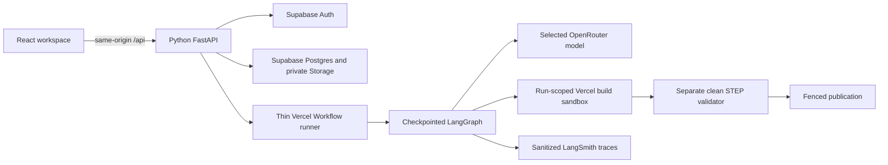

# Cloud operations

## Service boundaries

The coordinator delegates complete CAD tasks, inspects results and publishes. The CAD role edits, builds, inspects errors, repairs and verifies. Engineering calculations have separate file permissions and execute twice to check reproducibility. These are model roles; the independent validator is deterministic Python.

## Runtime and recovery

One sandbox is created for a CAD role's active run. Each build uses a new unprivileged Python process and clean workspace/output directories. Runtime files are protected and their installed hash is checked. No application credentials enter the sandbox; networking is denied. Child processes are terminated before inspection or reuse. A timeout, failed cleanup or expired environment pauses the run and destroys its environment. Validation always happens in a separate sandbox with STEP files and metadata, without candidate source.

External operations are recorded before execution. Completed results replay without another model call or build. Unknown outcomes pause instead of repeating a potentially charged request. Continue grants a new bounded cycle and keeps the checkpoint. Publication checks the worker lease, base revision and validated candidate identity, and uses one deterministic revision ID per run.

`VERCEL_ENV` isolates preview and production jobs. Never accept execution environment names from browser requests. Test conversations from the old TypeScript engine are readable but cannot resume under the new runtime.

Uploads are registered before writing private storage. Cleanup retains candidate artifacts needed by paused runs, removes abandoned staged objects and prunes exports according to the administrator's retention setting. Source revision history remains available for rebuilding.

## Deployment

Keep the existing project IDs: Vercel `forma-cad`; Supabase `bisbakbhybkhcjztqnag`. Do not change unrelated projects.

1. Apply versioned Supabase migrations.
2. Configure server variables from `apps/api/.env.example` for the intended Vercel environment.
3. Build the reviewed CAD snapshot and set its matching snapshot ID and runtime hash together.
4. Deploy a preview with the current `services` configuration.
5. Verify authentication, workflow execution, pause/resume, actual artifacts and tracing on that preview.
6. Deploy production without changing the stable alias until its complete path is verified. A production build must use production environment variables; promoting a preview unchanged also retains its preview job environment.

Keep `MODEL_ENCRYPTION_KEY` backed up. Rotating it requires re-encrypting saved model keys. Browser responses expose only key hints, never saved keys.

## LangGraph and LangSmith

LangGraph is the sole agent-state checkpoint owner. Vercel Workflow only schedules bounded transitions and exits at human interrupts. `SUPABASE_DATABASE_URL` points to the existing project's transaction pooler and is server-only. Run `python -m forma_api.setup_checkpoints` once before cutover.

LangSmith records graph transitions, sanitized prompts, model and tool metadata, token usage, cost and timings. Cookies, authorization headers, credentials and signed URLs are removed. Trace delivery failures cannot fail a design run. Rotate testing tokens before inviting other users or handling private designs.
