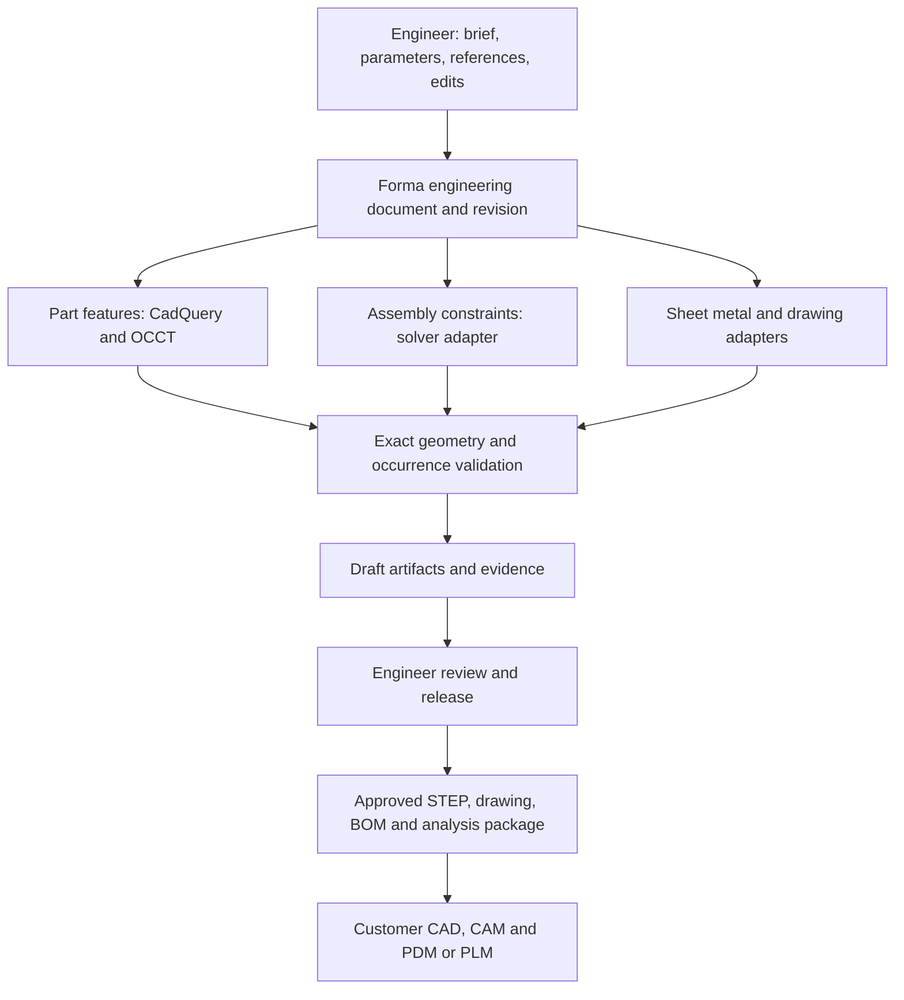

# Forma versus CATIA and SOLIDWORKS: capability, reliability, and adoption

Research date: 30 September 2026. Scope: mechanical design, production documentation, organizational adoption, and reusable backend technology. This is a research and planning document; no product implementation or CAD dependency changes were made.

Implementation update, 1 October 2026: the comparison below describes the original baseline. Forma has since integrated a qualified native adapter for five joint types, bounded numeric motion, independent grounding/residual/DOF checks, per-occurrence STEP validation and deterministic draft BOM exports/UI. Hosted 60-part builds, an edit, private application publication/downloads and the chat workflow passed. See [current acceptance evidence](FORMA_HOSTED_ASSEMBLY_ACCEPTANCE.json) and [release progress](FORMA_ASSEMBLY_BOM_RELEASE_PROGRESS.md); production promotion remains a separate gate. Drawings, advanced surfacing workflows, simulation, industrial scale and enterprise release/PLM gaps remain.

## 1. Executive assessment

Forma has a useful foundation for an AI-assisted mechanical design platform: Python-authored parametric geometry, CadQuery/OCCT boundary representation (B-rep), isolated execution, independent STEP inspection, component definitions and instances, and saved source revisions. It is currently an early CAD generation workspace, rather than a complete professional CAD authoring and release system.

The principal gap is predictable behavior throughout an engineering change. A professional workflow must preserve design intent when a parameter changes, solve assembly relationships, update dependent drawings and BOMs, expose errors, retain the approved revision, and produce evidence another engineer can inspect. Generating a valid solid is only one step in that workflow.

**Recommendation:** pursue a complementary engineering platform first, for a defined family of parts and small assemblies. Keep CadQuery/OCCT; evaluate existing constraint, sheet-metal, drawing, and simulation engines behind adapters. Build Forma's engineering document model, edit semantics, verification, and release controls. Do not begin by developing a new geometric kernel or general-purpose solver.

The evidence does not establish a numerical reliability or precision ranking between Forma, CATIA, and SOLIDWORKS. Vendor documentation establishes available workflows, not comparative benchmark results. Forma needs a representative test corpus before claiming equivalent reliability.

### Comparison boundaries

- CATIA V5 and 3DEXPERIENCE CATIA are different deployments. The comparison includes relevant CATIA roles and its Dassault ecosystem; PLM, advanced simulation, and CAM are not assumed to be included in every CATIA license.
- SOLIDWORKS capabilities similarly depend on edition, add-ins, and connected services. Simulation, MBD, PDM, CAM, and tolerance analysis must be scoped to the purchased configuration.
- Forma's current capability is assessed from this checkout. A library API, schema field, or historical successful fixture is not counted as a finished, verified product feature. The deployed database and hosted CAD image were not inspected during this research.

Dassault documents CATIA's mechanical modeling, advanced surfaces, and integrated product-data workflows, while SOLIDWORKS documents its CAD and related engineering products. These establish the commercial reference scope. [CATIA mechanical engineering](https://www.3ds.com/products/catia/engineering/mechanical-engineering), [SOLIDWORKS Design](https://www.solidworks.com/product/solidworks-design).

## 2. What Forma actually has today

| Area | Evidence in Forma | Practical limit |
| --- | --- | --- |
| Geometry | CadQuery 2.8.0 declared; cadquery-ocp 7.9.3.1.1 locked; generated Python returns Workplane, Shape, or Assembly | Kernel operations are available, but the product does not yet guarantee their successful use across a documented design envelope |
| Parametric source | Component parameters, source files, dependencies, saved snapshots | Python rebuilds are not an editable CAD feature graph with sketch/feature diagnostics |
| Assembly structure | Definitions, repeated instances, parent hierarchy, placements, joint/reference/configuration metadata | The trusted build path does not solve or enforce the manifest's joint graph |
| Inspection | STEP re-import, B-rep validity, volume, bounds, surface inventory, optional density-derived mass, pairwise interference and nearby distance checks | This establishes limited geometric evidence, not complete assembly or manufacturing acceptance |
| Requirements | Dimensions, envelope, bounding-box center, solid count, selected through-hole and radius checks; unsupported requirements remain unverified | A small set of deterministic checks; no general tolerance, motion, GD&T, or process validation |
| Artifacts | STEP and GLB CAD artifacts; engineering plots | No complete drawing, flat-pattern, BOM, IGES/STL import/export, or CAM product workflow |
| Revisions | Stored snapshots, revision ordinals, restore provenance, stale-base publication guard | No independent engineering approval/release lifecycle or PDM integration |
| Security/operations | Account ownership, private artifacts, encrypted provider credentials, execution isolation, durable run/checkpoint infrastructure | Team permissions, enterprise identity, CAD-IP data policy, restore evidence, and operating guarantees are still needed |

Local evidence: [runtime dependencies](D:/v1/runtimes/python/pyproject.toml), [lockfile](D:/v1/runtimes/python/uv.lock), [contracts](D:/v1/apps/api/forma_api/contracts.py:47), [build/export and validator](D:/v1/runtimes/python/forma_runtime.py:58), [inspection](D:/v1/runtimes/python/geometry_inspection.py:68), [requirement checks](D:/v1/runtimes/python/requirements_check.py:64), [artifact restrictions](D:/v1/apps/api/forma_api/execution.py:73), [revision schema and publication](D:/v1/supabase/migrations/20260831021659_initial_cad_workspace.sql:28), [ownership and artifact access](D:/v1/apps/api/forma_api/repositories/projects.py:23).

### Current issues that materially affect engineering trust

1. **Joint metadata is descriptive rather than enforced.** Joint endpoints contain reference IDs but no occurrence IDs. Two copies of the same part can therefore be ambiguous. The build path calls generated component code and exports its result; it does not automatically constrain/solve manifest joints. Generated code could explicitly use CadQuery's solver, but this is not a trusted, universal assembly service.
2. **Assembly export/preview agreement is incompletely verified.** STEP is re-imported as a shape for inspection, while the preview is placed from manifest frames. The comparison checks overall bounds, not every occurrence's identity, position, and orientation. Incorrect internal placement can preserve those same bounds. The OCCT placement and preview Euler-transform paths also need equivalence tests; a numerical discrepancy was not reproduced in this research.
3. **Successful build bypasses the automated reviewer.** The normal successful validation route publishes directly. The implemented reviewer is not the final acceptance gate on that route. This is consistent with a draft workspace, but insufficient for claiming engineering acceptance.
4. **Failed advisory requirements can still be published.** This is explicitly allowed by the publication migration. Publishing a draft can be useful; advancing it as the project's current revision needs a separate accepted/released state before production use.
5. **Some measurement names are stronger than their implementation.** `connectedSolidCount` equals the count of solids without establishing mechanical connectivity. A requirement named `center` measures the bounding-box midpoint, not center of gravity. The latter distinction is especially important for asymmetric parts and mixed-material assemblies.
6. **Edit context is incomplete.** The coordinator starts CAD history from the run's original request. Selected instance IDs stored by the runner are not consumed by the coordinator/CAD session. This makes selection-sensitive edits and preservation of earlier design intent less dependable.
7. **Scale is bounded and not benchmarked.** The schema limits components to 200, instances to 1,000, and serialized source snapshots to 2 MB. Every component is rebuilt; the preview creates meshes for each leaf occurrence; inspection loops over instance pairs. The checked-in migrations retain a global unique index permitting one running run. If applied, that index serializes organization-wide work. These are implementation limits, not measured safe capacities.
8. **Runtime identity needs stronger evidence.** The snapshot update script copies runtime files and the lockfile into an existing image but does not install dependencies from that lockfile. The image must report actual installed versions and hashes before its runtime label can establish reproducibility.

Evidence: [joint contracts](D:/v1/apps/api/forma_api/contracts.py:63), [runtime scene/STEP checks](D:/v1/runtimes/python/forma_runtime.py:133), [successful validation route](D:/v1/apps/api/forma_api/graphs/design.py:1482), [advisory publication policy](D:/v1/supabase/migrations/20260905090000_allow_advisory_validation_failures.sql:1), [coordinator](D:/v1/apps/api/forma_api/graphs/design.py:567), [runner selection context](D:/v1/apps/api/forma_api/graphs/runner.py:39), [snapshot preparation](D:/v1/scripts/create_runtime_snapshot.py:18).

## 3. Feature gap matrix

**Forma status:** A = implemented within the stated scope; P = partial implementation or library capability without a complete product workflow; M = missing product workflow. These are capability classifications, not reliability certifications.

**Difficulty:** Low = bounded application work; Medium = substantial integration; High = specialist CAD engineering and extensive verification; Very high = a major product subsystem. Ratings assume reuse of existing engines. They are relative judgments, not schedule estimates.

**Priority:** P0 = foundation or minimum for the proposed controlled pilot; P1 = next stage for the stated mechanical-design scope; P2 = domain-dependent expansion. An organization's specific requirements can move any item to P0. Commercial entries describe available capabilities with the relevant licenses, not every base package.

### Part design

| Feature | CATIA | SOLIDWORKS | Forma Current Capability | Can Forma Implement It? | Difficulty | Priority |
| --- | --- | --- | --- | --- | --- | --- |
| Parametric part dimensions and equations | Supported | Supported | P: Python parameters and source rebuild | Yes; typed parameters, units, dependencies, validated edit ranges | Medium | P0 |
| Interactive constrained sketches | Sketcher | Sketch relations and dimensions | M: no persistent interactive sketch system; CQ sketch solver available | Yes; PlaneGCS/FreeCAD or another sketch solver | High | P1 |
| Under/overconstraint and conflict diagnostics | Supported | Supported | M: no sketch diagnostic workflow | Yes; solver diagnostics plus product interpretation | High | P1 |
| Extrude, revolve, sweep, loft, Boolean operations | Supported | Supported | P: CQ/OCCT operations usable in generated source | Yes; formalize supported cases and test them | Medium | P0 |
| Fillet, chamfer, shell, draft, holes | Supported | Supported | P: library APIs available; no complete feature-edit workflow | Yes; operation diagnostics, references, parameter envelope | High | P0 for promised features |
| Patterns, mirrors, multi-body parts | Supported | Supported | P: script-generated geometry | Yes; preserve occurrence/feature identities and edit semantics | Medium | P1 |
| Editable feature history, reorder, suppress, rollback | Specification/history workflows | FeatureManager and rollback | M: source history and operation annotations are not an executable feature tree | Yes; feature graph or FreeCAD document backend | High | P1 |
| Controlled edits and stable geometric references | Dependency/reference management | Dependency/reference management | P: authored semantic coordinates; no proven topology tracking | Yes; identity, reference resolution, change diagnostics | Very high for generality | P0 |
| Basic surfaces, trimming, sewing, solidification | Supported | Supported | P: OCCT can represent and operate on surfaces | Yes; additional APIs, selectors, continuity checks | High | P1/P2 |
| Advanced surfacing and Class A workflow | Specialist CATIA capabilities | Advanced surfacing; workflow differs from CATIA | M: no demonstrated comparable authoring/analysis workflow | Limited scope first; general parity requires extensive development or specialist SDKs | Very high | P2 |
| Sheet metal, bends, reliefs, manufacturing flat pattern | Specialized applications | Integrated sheet-metal tools | M: can script folded solids, but no validated sheet-metal system | Yes; FreeCAD SheetMetal; evaluate new build123d support | High | P1; P0 for enclosure pilot |
| Weldments, structural members, trim, cut list | Structural design tools/roles | Weldment tools and cut lists | M: generic solids can depict frames | Yes; CQ/OCCT plus member/profile/process metadata | Medium/High | P1 |

### Assembly design

| Feature | CATIA | SOLIDWORKS | Forma Current Capability | Can Forma Implement It? | Difficulty | Priority |
| --- | --- | --- | --- | --- | --- | --- |
| Parts, repeated instances, nested subassemblies | Supported | Supported | A: definition/instance hierarchy and static placements | Yes; strengthen hierarchy/export consistency | Medium | P0 |
| Persistent mates/engineering connections | Supported | Supported | P: joint/reference metadata; no trusted manifest solve | Yes; CQ static solver and/or Ondsel adapter | High | P0 |
| Assembly degrees of freedom and constraint conflicts | Supported | Supported | M: no product-level diagnostics | Yes; solver results, rank/constraint diagnostics where available, residual checks | High | P0 |
| Configurations, suppression, variant control | Supported | Supported | P: alternate frames as metadata | Yes; explicit variants, geometry rebuilds, configuration-specific exports | High | P1 |
| Contextual/skeleton/top-down assembly design | Supported | Supported | P: source dependencies without equivalent authoring controls | Yes; controlled cross-part references and dependency ownership | High | P1 |
| Static interference detection | Clash analysis | Interference Detection | A: exact pairwise overlap checks in supported inspection paths | Yes; exceptions, acceptable contacts, targeted analysis, scale tests | Medium | P0 |
| Clearance and hole/axis alignment acceptance | Supported | Clearance and alignment tools | P: nearby distance checks; no general functional acceptance | Yes; requirement-driven exact queries with explicit scope | Medium/High | P0 |
| Collision checking during motion | Motion/clash workflows | Moving-component collision and motion tools | M: no solved motion trajectory | Yes; kinematics plus collision checks; continuous guarantees need more work | High | P1 |
| Closed-loop mechanisms, limits, driven motion | Kinematics roles | Mechanical mates/Motion | M: manual configurations do not enforce mechanism closure | Yes; Ondsel or specialist solver, continuity and singularity handling | High | P1; P0 for mechanism pilot |
| Forces, torque, contacts, friction, dynamics | Specialist motion/simulation roles | Motion Analysis/Simulation offerings | M: no validated multibody dynamics workflow | Yes through a solver; not equivalent to posing/animation | Very high | P2 |
| Large assembly partial loading and simplified representations | Product-context/large-assembly tools | Lightweight, SpeedPak, Large Design Review | M: whole-build/whole-preview approach and fixed limits | Yes; caching, instancing, selective loading, partitioned validation | Very high | P1, then P2 at OEM scale |
| Exploded views and assembly documentation | Supported | Supported | M: no complete linked documentation workflow | Yes; instance transformations and linked BOM balloons | Medium | P1 |

### Engineering, manufacturing, and file exchange

| Feature | CATIA | SOLIDWORKS | Forma Current Capability | Can Forma Implement It? | Difficulty | Priority |
| --- | --- | --- | --- | --- | --- | --- |
| Volume, area, density-based mass | Supported | Mass Properties | A: volume/area; mass when density is assigned | Yes; material provenance, units, assembly aggregation | Low/Medium | P0 |
| Center of gravity and inertia tensor | Supported | Mass Properties | M: not exposed as trusted project measurements | Yes; OCCT integration and correct instance transforms/material weighting | Medium | P0 |
| Dimensional limits, fits, tolerance stack-up | Tolerancing/specialist analysis | Dimensions, DimXpert/TolAnalyst | P: nominal measurement tolerance only | Yes; start with explicit dimensional chains; spatial stacks are harder | High/Very high | P1; P0 for fit-critical scope |
| Requirement-based design acceptance | Evaluation and engineering tools | Evaluation/Design Checker and related tools | P: narrow deterministic checks; advisory failures publish | Yes; scoped hard requirements, evidence, reviewer/release gate | High | P0 |
| FEA: mesh, loads, materials, stress/deformation | CATIA structural roles/SIMULIA ecosystem | Simulation offerings | M: calculations/plots are not a validated CAD-linked FEA system | Yes; Gmsh/CalculiX or existing CAE integrations | High | P2; P0 when required by pilot |
| Advanced nonlinear/contact/fatigue/thermal/CFD | Specialist Dassault solutions | Simulation/Flow and related offerings | M | External engines/integrations; validate each analysis class separately | Very high | P2 |
| Manufacturability checks | Process-specific applications | DFM/process tools | M: no general process-aware acceptance | Yes for defined processes; tool access, wall/bend rules, feature recognition | High | P1; P0 for selected process |
| Orthographic/isometric/section/detail drawing views | Drafting | Associative drawings | M: no engineering drawing artifact workflow | Yes; TechDraw or OCCT HLR plus custom document service | High | P1; P0 for released drawing output |
| Associative dimensions, centerlines, annotations | Supported | Supported | M | Yes; semantic references, recompute, layout, stale-reference detection | High | P0 for drawing scope |
| GD&T, datums, semantic PMI/MBD | 3D Tolerancing & Annotation role | DimXpert/MBD capabilities | M | Bounded symbols first; semantic tolerancing is a larger subsystem | Very high | P1/P2; P0 where specified |
| BOMs, properties, balloon/table linking | Product structure/drafting | Linked assembly/drawing BOM | M: instance structure exists but no trusted BOM product | Yes; derive from configuration-specific occurrence graph | Medium | P0 for assembly deliverables |
| STEP export and independent re-import | Supported | Supported | A: export and internal STEP re-import | Yes; certify units, occurrences, colors/names, supported STEP profile | Medium | P0 |
| User STEP import, healing, editable imported-body workflow | MultiCAD/exchange tools | Translators, 3D Interconnect, diagnostics | M: internal re-import is not a user import feature | Yes; assets, metadata, diagnostics, exact-geometry checks | High | P0 for complementary adoption |
| IGES/STL/DXF and other neutral files | Supported by relevant translators | Supported by relevant translators | M: library support does not create a product workflow | Yes; implement and test each direction and information loss | Medium/High | P1 |
| Native CATPart/CATProduct/SLDPRT/SLDASM exchange | Native CATIA; other translation depends on product | Native SW; other translation depends on product | M | Licensed translator or vendor automation; full native feature-history fidelity is not promised | Very high | P2; customer-specific |
| CAM toolpaths, stock/tool setup, postprocessing, verification | CATIA manufacturing/DELMIA ecosystem | CAM add-in and partner ecosystem | M | Integrate CAM first; a toolpath algorithm is only part of the system | Very high | P2 |

### Reliability and organizational workflows

| Feature | CATIA | SOLIDWORKS | Forma Current Capability | Can Forma Implement It? | Difficulty | Priority |
| --- | --- | --- | --- | --- | --- | --- |
| Exact B-rep geometric kernel | CGM lineage | Parasolid | A: OCCT through CadQuery/OCP | Already present; optional commercial kernel based on measured need | High if replacing kernel | P0 verification |
| Reliable regeneration across edits | Established edit/regeneration workflows; failures possible | Established edit/regeneration workflows; failures possible | P: reruns Python; no comparative edit benchmark | Yes for defined scope; general parity needs sustained CAD engineering | Very high | P0 |
| Feature/import failure diagnosis and controlled repair | Modeling diagnostics | Feature errors and Import Diagnostics | P: errors and bounded agent repairs | Yes; isolate failing feature/reference, expose repair effects | High | P0 |
| Version history and reproducible rebuild | Native files/platform lifecycle | Native files/PDM/platform lifecycle | P: source snapshots and version labels | Yes; actual environment inventory, immutable dependencies, rebuild evidence | High | P0 |
| Approved/released revisions and engineering changes | ENOVIA/3DEXPERIENCE workflows | PDM/connected platform workflows | M: revisions exist; separate release lifecycle absent | Yes; approval states, immutable release packages, change records | High | P0 |
| Team collaboration, roles, concurrent edits | Platform collaboration | PDM/cloud collaboration | P: owner/admin access and chat workspace | Yes; team ACLs, conflict control, shared review and ownership | High | P0 |
| PDM/PLM, where-used, effectivity, EBOM/MBOM | Platform ecosystem | PDM/Manage/platform/integrations | M | Integrate the customer's system before attempting broad replacement | Very high | P1; P0 for pilot handoff |
| Enterprise identity, IP policy, audit and recovery | Deployment/platform services | PDM/platform/customer IT controls | P: security foundations; enterprise controls unverified | Yes; SSO/roles, provider policy, audit retention, tested restoration | High | P0 for enterprise deployment |
| CAD APIs, automation and extensions | Automation/CAA/platform APIs by deployment | CAD/PDM APIs and ecosystem | P: application API and fixed agent tool set | Yes; stable geometry/project APIs and controlled adapters | High | P1 |
| Organization-scale job throughput and project data | Established deployment options | Desktop/PDM/platform options | M: checked-in schema has a global running-job constraint; scale unmeasured | Yes; fair scheduling, quotas, indexing, caching, load tests | High | P0 for multi-team pilot |
| Long-term compatibility, support and maintenance | Established vendor lifecycle | Established vendor lifecycle/hotfixes | P: early codebase; migration/support guarantees absent | Yes within declared scope; requires operating discipline and ownership | High, ongoing | P0 |

Commercial sources for this matrix: [CATIA training scope, part/assembly/drafting/sheet-metal](https://www.3ds.com/store/get-started/professionals/plm-express-design-engineering), [CATIA large-product context](https://www.3ds.com/products/catia/engineering?wocset=3), [CATIA motion role](https://3dswym.3dexperience.3ds.com/wiki/catia-user-community/catia-mechanical-motion-designer_PFk113HVRJidvPYD3A-Ajw), [CATIA semantic tolerancing](https://3dswym.3dexperience.3ds.com/wiki/catia-user-community/catia-3d-tolerancing-annotation-designer_gPUBROhZSUCSy_h36Hg3Bg), [SOLIDWORKS sketch definition](https://help.solidworks.com/2025/english/solidworks/sldworks/t_Creating_Fully_Defined_Sketches.htm), [feature rollback](https://help.solidworks.com/2026/english/SolidWorks/sldworks/c_rollback_bar.htm), [assembly simplification](https://help.solidworks.com/2026/English/SolidWorks/Sldworks/t_simplified_representations_assemblies.htm), [interference detection](https://help.solidworks.com/2026/english/SolidWorks/sldworks/t_detecting_interferences.htm), [mass properties](https://help.solidworks.com/2026/english/SolidWorks/sldworks/c_Mass_and_Section_Properties_Overview.htm), [TolAnalyst](https://help.solidworks.com/2025/english/solidworks/sldworks/c_TolAnalyst_Overview.htm), [Simulation](https://www.solidworks.com/product/solidworks-simulation), [MBD](https://www.solidworks.com/product/solidworks-mbd), [BOM behavior](https://help.solidworks.com/2024/english/solidworks/sldworks/c_Bill_of_Materials_-_Overview2.htm), [file exchange](https://help.solidworks.com/2024/English/SolidWorks/sldworks/c_Importing-Exporting_SOLIDWORKS_Documents.htm), [SOLIDWORKS CAM](https://www.solidworks.com/product/solidworks-cam), [DELMIA machining](https://www.3ds.com/products/delmia/industrial-engineering/machining), [SOLIDWORKS PDM](https://www.solidworks.com/product/solidworks-pdm).

## 4. What separates the workflows in practice

### Part design: preserving intent through edits

CadQuery gives Forma real extrusion, revolution, sweeping, lofting, Boolean, and finishing operations. That is suitable for many machined parts, brackets, housings, and fixtures. It does not automatically provide a persistent sketch/feature editor. CadQuery's documented constraint-based sketch solver remains experimental; its documented scope should not be equated with a complete commercial sketcher. [CadQuery overview](https://github.com/CadQuery/cadquery), [CadQuery constrained sketches](https://cadquery.readthedocs.io/en/stable/sketch.html).

For example, changing a bracket width from 80 to 100 mm should move its hole pattern according to its intended datum scheme, retain the chosen mounting faces, and update dependent references. Merely generating another valid bracket is insufficient. Face ordering, a selector that matches a different edge, or a rewritten script can change the design while the B-rep validator still passes.

An executable feature graph should distinguish sketches, constraints, parameters, features, references, and their dependencies. Forma's existing `featureOperations` records describe intent; they do not execute features, preserve topology, or support reorder/suppress/rollback. A scripted expert workflow can be credible without a full mouse-driven feature tree, but it still needs inspectable dependencies and deterministic edits. SOLIDWORKS' rollback workflow illustrates this additional editing behavior. [Rollback documentation](https://help.solidworks.com/2026/english/SolidWorks/sldworks/c_rollback_bar.htm).

Basic spline/surface operations are technically possible with OCCT. Matching advanced surfacing means additionally delivering continuity control, surface-quality analysis, trim/sew repair, stable references, and specialist workflows. CATIA's advanced shape capabilities are a substantially larger target than exposing a loft function. [CATIA mechanical and surface scope](https://www.3ds.com/products/catia/engineering/mechanical-engineering).

### Assembly design: a posed assembly versus a solved mechanism

Forma's instance hierarchy is valuable. It must become the authoritative structure shared by the solver, exact geometry, preview, BOM, and export. Every joint must identify both occurrences and their local frames, and every solved pose must carry a status and validation evidence.

A four-bar linkage demonstrates the difference. Correct-looking positions at three angles do not prove link lengths, revolute axes, closure, allowed motion, or clearance throughout travel. A solver needs grounding, consistent joint frames, initial conditions, driver values, limits, convergence diagnostics, and handling of singular or alternative branches. Its output must then be checked against the exact geometry. CATIA's documented motion workflow reuses engineering connections and includes clash checks, motion measurements, and trajectory tools. [CATIA Mechanical Motion Designer](https://3dswym.3dexperience.3ds.com/wiki/catia-user-community/catia-mechanical-motion-designer_PFk113HVRJidvPYD3A-Ajw).

Static interference checks also need interpretation. A press-fit can intentionally overlap; mating surfaces can touch; fasteners may use simplified threads. Forma needs explicit allowable-contact/interference rules. Numerical failure of a pairwise query must remain visible rather than becoming a successful clearance check. Discrete motion samples can miss collisions between samples; sampled acceptance must state its coverage instead of claiming continuous collision freedom.

Large assembly support requires more than increasing the instance limit. Use shared meshes, partial loading, cached component builds, simplified representations, incremental dependency rebuilding, and spatial broad-phase filtering before exact pair checks. SOLIDWORKS documents selective opening and lightweight representations that retain mate effects while reducing loaded components. [Simplified assemblies](https://help.solidworks.com/2026/English/SolidWorks/Sldworks/t_simplified_representations_assemblies.htm).

### Engineering validation: measurements, tolerances, and analysis

Mass, center of gravity, and inertia are tractable additions using exact geometry and material density. Assembly results must transform each part's properties into the correct frame, apply material weighting and the parallel-axis theorem where appropriate, and distinguish unknown density from zero mass. SOLIDWORKS exposes mass properties across parts, bodies, components, and assemblies; Forma currently exposes only a subset. [Mass properties](https://help.solidworks.com/2026/english/SolidWorks/sldworks/c_Mass_and_Section_Properties_Overview.htm).

Four different concepts must remain separate:

1. **Kernel tolerance:** numerical/geometric tolerances used by modeling algorithms.
2. **Verification tolerance:** allowed error in a particular comparison. Forma's requirement default is 0.02 mm; that is not a measurement of the kernel's accuracy or a manufacturing tolerance.
3. **Manufacturing tolerance:** acceptable variation of an actual manufactured feature.
4. **Functional stack-up:** the accumulated effect of feature tolerances, datum choices, and assembly conditions on fit/function.

GD&T is a semantic system, not a collection of text symbols. Forma needs datum/feature identity, tolerance types and values, material-condition modifiers where supported, interpretation rules, and revision association. Begin with an explicit supported subset. ASME Y14.5 concerns dimensioning/tolerancing rules; ISO 129-1 concerns presentation of dimensions and associated tolerances and explicitly does not cover all tolerancing meaning. A style preset alone cannot establish full compliance. [ASME Y14.5](https://www.asme.org/codes-standards/find-codes-standards/dimensioning-and-tolerancing), [ISO 129-1](https://www.iso.org/standard/64007.html).

FEA requires a complete analysis definition: materials, loads, supports, contacts, mesh/element quality, solver settings, convergence, result provenance, and an engineer's interpretation. An LLM calculation or colored stress image is not an equivalent validation process. SOLIDWORKS offers multiple analysis classes through different packages; generated calculations in Forma do not implement those solvers. [SOLIDWORKS Simulation packages](https://www.solidworks.com/product/solidworks-simulation).

### Manufacturing documentation and handoff

An engineering drawing must reference a particular part/assembly revision and configuration. Orthographic views need consistent projection convention, scale, hidden lines, centerlines, sections, and annotation placement. Dimensions must measure the intended model feature rather than screen pixels. After an edit, the drawing must either update correctly or identify an unresolved reference.

A BOM must count occurrences, rather than simply list distinct geometry files. It needs part number, revision, description, quantity/unit, material and purchased/manufactured status, configuration/suppression rules, and stable item numbers linking balloons to rows. A nested subassembly used three times must contribute the correct quantities. SOLIDWORKS documents automatic BOM updates and drawing balloon relationships. [BOM documentation](https://help.solidworks.com/2024/english/solidworks/sldworks/c_Bill_of_Materials_-_Overview2.htm).

STEP is appropriate for exact-geometry handoff, but it does not automatically recreate CATIA/SOLIDWORKS sketches, feature history, or native mates. STEP AP242 can carry PMI when supported by the exporter/importer; that should not be confused with Forma's present basic STEP export. SOLIDWORKS MBD explicitly supports publishing annotations through STEP 242. [SOLIDWORKS MBD](https://www.solidworks.com/product/solidworks-mbd).

CAM/CNC needs stock, fixtures, tool assemblies, feeds/speeds, operations, toolpath verification, and controller-specific postprocessors. For early adoption, export approved geometry to the organization's existing CAM workflow. Integrate a proven CAM system before considering ownership of machine-code generation. [SOLIDWORKS CAM](https://www.solidworks.com/product/solidworks-cam), [DELMIA machining](https://www.3ds.com/products/delmia/industrial-engineering/machining).

## 5. Reliability and precision: what can and cannot be claimed

SOLIDWORKS uses Parasolid; CATIA has CGM kernel lineage; Forma uses OCCT. OCCT is a substantial exact-geometry CAD kernel, so Forma's models are not inherently approximate meshes. Choosing OCCT does not establish equality with the commercial systems, and switching kernels would not supply sketch history, mates, drawings, or release management. [Siemens kernel comparison](https://resources.sw.siemens.com/sv-SE/white-paper-how-to-manage-cad-kernel-data/), [Spatial kernel explanation](https://www.spatial.com/glossary/geometric-modeling-kernel).

The GLB viewer is tessellated. It is useful for interaction but must not be the source for precise manufacturing dimensions or final geometry validation. Numerical tolerances, topology validity, and manufacturing intent should be evaluated from B-rep geometry. Accurate geometry can still describe the wrong design.

Commercial CAD also encounters invalid imports, failed operations, and regressions. SOLIDWORKS documents face/gap diagnostics and repair, and publishes hotfixes. Its advantage relevant to Forma is the established workflow for locating, explaining, recovering from, and maintaining models through those failures. It is not a promise that every model rebuilds successfully. [Import Diagnostics](https://help.solidworks.com/2026/English/SolidWorks/sldworks/HIDD_DVE_HEALING.htm), [SOLIDWORKS hotfixes](https://www.solidworks.com/support/general-hotfixes).

| Failure scenario | What Forma must detect or preserve | Current evidence/gap |
| --- | --- | --- |
| Fillet radius exceeds local geometry | Identify failing feature and valid parameter range; retain last good state | Bounded repair exists; feature-level acceptance envelope absent |
| Shell thickness removes thin walls or self-intersects | Fail clearly; never silently omit the requested shell | Kernel validity alone does not verify the requested feature happened |
| Changing dimensions changes face/edge ordering | Resolve intended reference or mark it broken; no silent rebinding | No demonstrated general topology-tracking system |
| Hole pattern changes from four holes to six | Update instances, references, drawings, BOM; verify pitch and datum relation | Narrow hole checks exist; dependent-artifact workflow absent |
| Two identical parts appear in one assembly | Constrain the chosen occurrences independently | Manifest joint endpoints are not occurrence-specific |
| Internal assembly placement is wrong but overall bounds match | Compare exact instance transforms and geometry | Current whole-assembly bounds check cannot exclude this |
| Mechanism reaches a singular pose or has multiple branches | Report status and preserve branch continuity where defined | No trusted mechanism solver/trajectory acceptance |
| Export loses units, occurrence structure, or PMI | Detect loss; explain supported exchange contract | Re-import validation exists, but no comprehensive exchange certification |
| New runtime changes Boolean or solver results | Identify environment and geometry differences; allow pinned rebuild | Declared lockfile alone does not prove installed image contents |
| Agent misunderstands an edit or drops a requirement | Requirement coverage, scoped change review, human confirmation at release | Selection/context and review-routing gaps remain |

These scenarios are a proposed benchmark set. They were not all reproduced in this session. No claim of a universal failure rate, comparative speedup, or sub-micron precision is justified by the current evidence.

### Evidence needed before reliability claims

- Separate **intent correctness**, **valid geometry**, **edit/regeneration success**, **reference preservation**, **assembly solve correctness**, and **export fidelity**. Report all of them.
- Separate deterministic CAD rebuilding from stochastic AI generation. Rebuilding accepted source should not require asking the model to regenerate the design.
- Test a published supported envelope of parameters, operation combinations, and imported geometry. Test expected failures outside that envelope as well.
- Use independent analytical examples and customer-approved CAD baselines. Validating with the same CAD kernel in another process is useful export checking, but not fully independent evidence of every geometric or engineering property.
- Record unresolved requirements, solver failures, query errors, and stale drawings explicitly. An unsupported check is not a pass.
- Measure p50/p95 latency, memory, crash/timeout frequency, regeneration failures, concurrency, and recovery behavior at representative model sizes. Schema limits are not scalability evidence.

## 6. Reusable backend engines and libraries

This shortlist concerns computation and document behavior, rather than copying another application's interface.

| Engine/library | Useful contribution | Important boundary | Recommendation |
| --- | --- | --- | --- |
| CadQuery + OCP/OCCT | Scripted parametric B-rep modeling, exact queries, static constraint-based assemblies, STEP | Not a complete feature-tree, manufacturing, or release system | Keep as primary part-modeling runtime |
| build123d | Alternative Python modeling API, named joints, projection/export utilities | Joints are one-time positioning; newest sheet-metal features are development-only and current release requires OCCT 8 | Evaluate isolated specialist tasks; no wholesale migration now |
| FreeCAD App/Part/Sketcher/Assembly/TechDraw | Document features, sketches, assembly solver integration, technical drawing objects | Compiled runtime; document/reference mapping; some page exports depend on GUI view providers | Evaluate a separate specialist worker |
| FreeCAD/OndselSolver | Assembly constraints and multibody kinematics/dynamics code | C++ integration and diagnostics; not a ready-made Forma Python API | First candidate for mechanisms; prototype adapter before choosing |
| PlaneGCS | Geometric sketch constraints | Solver integration is distinct from sketch interaction/history/reference management | Reuse for persistent sketch support |
| FreeCAD SheetMetal | Bends, reliefs, K-factor/material data, unfolding and cut/bend output | Depends on FreeCAD; restricted geometry and fabrication assumptions | Strong current candidate for enclosure workflow |
| OCCT HLR + ezdxf | Exact projected linework and DXF entities/dimensions | Sheet layout, semantic dimensions, associativity, standards, PDF delivery remain application work | Alternative drawing path if TechDraw deployment is unsuitable |
| cq_warehouse / bd_warehouse | Parametric fasteners and other catalog parts | Catalog geometry is not complete supplier/material/process certification | Selectively reuse with pinned data and verification |
| FreeCAD frame tools / custom CQ member service | Structural profiles, beams and trimming examples | Smaller add-ons do not establish a complete weldment/cut-list system | Own member metadata and cut-list logic; evaluate geometry reuse |
| Gmsh + CalculiX / FreeCAD FEM | Mesh generation and finite-element solving | Analysis definition, boundary-condition references, result validation and licensing need integration | Add later for an explicit analysis class |
| FreeCAD CAM / OpenCAMLib | CAM operations/postprocessing or toolpath algorithms | Machine/stock/tool setup, code verification and production approval are separate work | Prefer external CAM handoff initially |
| Licensed Parasolid/CGM and translator SDKs | Alternative geometry and native-format translation | Commercial terms; migration effort; do not automatically recreate source feature history | Consider only after benchmarks/customer exchange requirements |

### Assembly solver choices

CadQuery already has `Assembly.constrain()` and `solve()`. A basic static mate service can reuse them; it must explicitly create constraints, check residuals/remaining freedom, and report ambiguity. CadQuery documents the solver's behavior and constraints; it does not turn Forma's manifest metadata into a moving mechanism automatically. [CadQuery assemblies](https://cadquery.readthedocs.io/en/latest/assy.html).

build123d documents rigid, revolute, linear, cylindrical, and ball joint helpers. Its documentation explicitly explains that connecting joints repositions a part once rather than binding parts together. Thus it is useful for named joint frames and posing, but should not be presented as a general closed-loop moving-assembly solver. [build123d joints](https://build123d.readthedocs.io/en/latest/joints.html).

The original Ondsel-Development solver repository is archived. The active FreeCAD fork is the relevant current candidate; FreeCAD's own submodule references it. Its assembly integration supports multiple joint types and simulation. Reuse that integration or build a narrow adapter; do not assume a supported standalone Python wheel exists. [Current solver](https://github.com/FreeCAD/OndselSolver), [FreeCAD submodules](https://github.com/FreeCAD/FreeCAD/blob/main/.gitmodules), [FreeCAD assembly integration](https://github.com/FreeCAD/FreeCAD/blob/1.1.4/src/Mod/Assembly/App/AssemblyObject.cpp), [assembly simulation documentation](https://github.com/FreeCAD/FreeCAD-documentation/blob/main/wiki/Assembly_CreateSimulation.md).

SolveSpace/libslvs is another genuine sketch/mechanism solver, but its GPL licensing changes the integration/distribution choices for a proprietary product. It is not an unlicensed drop-in substitute. PlaneGCS offers another sketch-engine route. A newer independent Python PlaneGCS wrapper exists, but its packaging/API maturity needs evaluation separately from FreeCAD's solver maturity. [SolveSpace technology](https://solvespace.com/tech.pl), [SolveSpace library licensing](https://solvespace.github.io/solvespace-web/library.html), [PlaneGCS source](https://github.com/FreeCAD/FreeCAD/blob/main/src/Mod/Sketcher/App/planegcs/SubSystem.cpp), [Python wrapper](https://github.com/spookylukey/planegcs).

### Sheet metal: two meaningful candidates

FreeCAD SheetMetal has existing bend/unfold logic and material/K-factor workflows. Its current new unfolder uses FreeCAD `Part`, TechDraw projection, and NetworkX; it is not code that can simply be imported into Forma's CadQuery-only environment. The source emphasizes planar and cylindrical surfaces and reports unsupported unfolding cases. Prove supported constant-thickness parts, reliefs, seams, and bend allowances against manufacturing examples. [SheetMetal repository/material workflow](https://github.com/shaise/FreeCAD_SheetMetal), [unfolder source](https://github.com/shaise/FreeCAD_SheetMetal/blob/master/SheetMetalNewUnfolder.py).

**New finding:** build123d's development branch now contains a surface-based sheet-metal system: flanges, bends, jogs, hems, reliefs, thickening, recovery of sheet surfaces, and unfolding. Its unfolding uses sheet thickness/K-factor/reference-surface parameters; geometric shell development without those parameters is not the same manufacturing flat pattern. This is a real research candidate, not an assumption that such support is absent. [Development sheet-metal overview](https://build123d.readthedocs.io/en/latest/sheet_metal/index.html), [pinned unfolding documentation](https://github.com/gumyr/build123d/blob/8b27707f7b7864c66e894a7e1129bc6832a4b7bd/docs/sheet_metal/unfold.rst).

On the research date, GitHub's latest stable build123d release was v0.13.0. Its tagged source tree lacks `build_sheet.py` and `operations_sheet.py`; the inspected development tree contains them. Both the current stable package and development branch require `cadquery-ocp-novtk >= 8.0, < 8.1`, whereas Forma locks cadquery-ocp 7.9.3.1.1. Evaluate it in a separate pinned environment; do not assume it can be installed beside Forma's current OCP package without conflict. [v0.13.0 release](https://github.com/gumyr/build123d/releases/tag/v0.13.0), [release dependencies](https://github.com/gumyr/build123d/blob/v0.13.0/pyproject.toml), [inspected development commit](https://github.com/gumyr/build123d/tree/8b27707f7b7864c66e894a7e1129bc6832a4b7bd).

A CAD flat pattern also needs the organization's actual material/process rules. A default K-factor does not establish fabrication accuracy. Arbitrary doubly curved forming, stamping behavior, springback, and bend sequencing are separate problems from unfolding a supported bent sheet.

### Drawings: projection is only the first layer

CadQuery can export projected SVG linework; build123d provides a multi-view drawing tutorial. Neither fact establishes a full associative drafting system. OCCT's HLR algorithms provide exact or polygonal hidden-line processing. For precise drawings, use the exact B-rep route and preserve geometric references. [CadQuery export](https://cadquery.readthedocs.io/en/latest/importexport.html), [build123d drawing tutorial](https://build123d.readthedocs.io/en/latest/tech_drawing_tutorial.html), [OCCT hidden-line algorithms](https://occt3d.com/dev/doc/overview/html/occt_user_guides__modeling_algos.html).

FreeCAD TechDraw is the most substantial reusable drawing candidate in this shortlist. It provides drawing views, sections, dimensions, annotations, templates, and export behavior. However, the ordinary PDF/SVG page-export functions in FreeCAD 1.1.4 obtain GUI view providers. A pure `FreeCADCmd` process should not be assumed to support the complete export path. Prove a controlled offscreen GUI worker or use App-level projected/DXF geometry plus Forma's own document renderer. No such deployment proof was run here. [TechDraw scope](https://github.com/FreeCAD/FreeCAD-documentation/blob/main/wiki/TechDraw_Workbench.md), [App projection/DXF API](https://github.com/FreeCAD/FreeCAD/blob/main/src/Mod/TechDraw/App/AppTechDrawPy.cpp), [release GUI exporter](https://github.com/FreeCAD/FreeCAD/blob/1.1.4/src/Mod/TechDraw/Gui/AppTechDrawGuiPy.cpp).

TechDraw documentation also identifies topological-reference risks and distinguishes projected measurements from true 3D measurements. Importing a STEP body does not transfer Forma's feature identities. The adapter needs a semantic reference mapping and must regenerate or flag dimensions after edits. [TechDraw dimension behavior](https://github.com/FreeCAD/FreeCAD-documentation/blob/main/wiki/TechDraw_LengthDimension.md).

ezdxf provides DXF dimension entities and styles. Its documentation explains rendering dimension graphics and compatibility limitations. It can serve as an output component; associativity and standards policy remain Forma's responsibilities. [DXF dimensions](https://ezdxf.readthedocs.io/en/stable/dxfentities/dimension.html), [dimension rendering tutorial](https://ezdxf.readthedocs.io/en/stable/tutorials/linear_dimension.html).

### Weldments, analysis, and CAM

Weldments can start with a profile catalog, centerline/member graph, extrusion/sweep, and trim/notch operations using the existing kernel. Store material/profile, end cuts, manufacturing length, member identity, and cut-list grouping. Do not equate visible beams with a fabrication-ready weldment. FreeCAD frame tools offer beam/miter/plane-cut examples; the older Metal workbench is archived and should not be the primary dependency. [Frame tools](https://github.com/looooo/freecad.frametools), [archived Metal workbench](https://github.com/lukh/metal-wb).

Catalog reuse can reduce repeated modeling: cq_warehouse and bd_warehouse provide parametric mechanical components. cq_warehouse's repository has less recent activity than bd_warehouse, so compatibility with Forma's pinned runtime needs testing. Do not infer supplier approval or complete standards compliance from a catalog model. [cq_warehouse](https://github.com/gumyr/cq_warehouse), [bd_warehouse](https://github.com/gumyr/bd_warehouse).

Gmsh and CalculiX are real meshing/FEA engines; CalculiX supports linear/nonlinear, static/dynamic, and thermal analysis. FreeCAD FEM already integrates external meshing/solver workflows. Start with a well-defined linear-static analysis and analytical reference cases, not a claim of general Simulation parity. [Gmsh manual](https://gmsh.info/doc/texinfo/), [CalculiX](https://www.calculix.de/), [FreeCAD FEM geometry/meshing guidance](https://github.com/FreeCAD/FreeCAD-documentation/blob/main/wiki/FEM_Geometry_Preparation_and_Meshing.md).

OpenCAMLib supplies toolpath algorithms, not an entire qualified CNC programming workflow. FreeCAD CAM is another integration candidate. Neither removes the need for machine-specific postprocessor validation and manufacturing review. [OpenCAMLib](https://github.com/aewallin/opencamlib), [FreeCAD CAM module](https://github.com/FreeCAD/FreeCAD/tree/main/src/Mod/CAM).

### Alternatives that do not close the main gap

- **OpenCascade.js** moves OCCT computation to WebAssembly. It may help browser interaction, but does not add a complete feature/assembly/drawing/release system. [Project](https://github.com/donalffons/opencascade.js).
- **Manifold** is a useful mesh-Boolean library. Mesh robustness does not replace exact engineering B-rep, semantic dimensions, and CAD exchange requirements. [Project](https://github.com/elalish/manifold).
- **OpenSCAD** is a capable scripted solid modeler, but changing to its modeling workflow would not by itself supply the missing assembly, drafting, and organizational systems. [Project description](https://openscad.org/about.html).
- **A commercial kernel** may improve specific geometry/exchange cases after measurement. It still needs Forma's product model, verification, and edit/release semantics. [Spatial SDKs](https://www.spatial.com/solutions).

### Licensing and maintenance facts

| Component | Upstream license evidence | Integration planning implication |
| --- | --- | --- |
| CadQuery | Apache 2.0 | Retain required notices; audit its dependencies separately |
| build123d / bd_warehouse / cq_warehouse | Apache 2.0 | Permissive component licensing; verify exact versions and bundled data |
| OCCT | LGPL 2.1 with additional exception | Follow OCCT's specific terms, rather than treating the whole runtime as Apache |
| FreeCAD / OndselSolver / current SheetMetal | LGPL family; inspect exact files and versions | Packaging, modifications, source obligations and dependency licenses need review |
| ezdxf | MIT | Permissive output-library licensing |
| SolveSpace | GPL v3 | Assess proprietary integration/distribution strategy explicitly |
| Gmsh / CalculiX | GPL family; Gmsh documents its specific conditions | Assess delivery model and component obligations before bundling/integration |
| OpenCAMLib | Current upstream uses LGPL | Pin current source; older license descriptions can be stale |

Open source does not mean non-commercial. The obligations depend on the exact license and manner of integration/distribution. A separate process is a useful runtime boundary, not an automatic licensing exemption. Archive exact licenses/notices with selected builds. The SheetMetal README still contains a stale GPL label even though its current LICENSE and code headers indicate LGPL; do not make decisions from that label alone.

Primary license evidence: [CadQuery](https://github.com/CadQuery/cadquery/blob/master/LICENSE), [build123d](https://github.com/gumyr/build123d/blob/dev/LICENSE), [OCCT](https://github.com/Open-Cascade-SAS/OCCT/blob/master/dox/license.md), [OndselSolver](https://github.com/FreeCAD/OndselSolver/blob/main/LICENSE), [SheetMetal](https://github.com/shaise/FreeCAD_SheetMetal/blob/master/LICENSE), [ezdxf](https://github.com/mozman/ezdxf/blob/master/LICENSE), [SolveSpace](https://solvespace.com/download.pl), [CalculiX license statement](https://www.calculix.de/), [Gmsh copying conditions](https://gmsh.info/doc/texinfo/), [OpenCAMLib](https://github.com/aewallin/opencamlib).

## 7. Proposed technical architecture

This is a recommendation, not an implemented design.

### Data Forma should own

- Part definitions, occurrence IDs, source/feature dependencies, parameters and units.
- Semantic datums/features with verified geometry bindings and explicit unresolved states.
- Occurrence-specific joint endpoints, local frames, grounding, drivers, limits, solver version/status/results.
- Material and process definitions, provenance, density and other properties required by each calculation.
- Sheet-metal thickness, bend radii/angles, allowance rules, relief/seam intent, formed/flat correspondence.
- Drawing sheets, views, scales, projection conventions, dimensions, annotation references, BOM links, and revision/configuration IDs.
- Requirements, evidence, exceptions, reviewer decisions, immutable released artifacts, and change impact.

STEP/BREP files carry geometry between workers. A separate versioned specification carries identities, parameters, connections, annotations, and process meaning. File translation alone must not become the engineering source of truth.

### Deployment options

| Option | Benefit | Cost or risk | Assessment |
| --- | --- | --- | --- |
| CadQuery/OCCT with narrow custom services | Fits current runtime; direct control over APIs | Substantial own work for drafting, sheet metal and general mechanisms | Good for a tightly scoped part/assembly pilot |
| CadQuery primary plus isolated FreeCAD specialist worker | Reuses existing sheet-metal, assembly and drawing implementations | Compiled dependencies, document adapters, GUI-dependent export proof, operational footprint | Preferred broad-capability candidate, subject to feasibility tests |
| FreeCAD document backend for most CAD work | Reuses feature/document/sketch ecosystem | Larger source-of-truth and runtime migration | Consider if persistent interactive history becomes the main product requirement |
| New geometric kernel and solvers | Complete ownership | Major multi-year engineering/maintenance undertaking; no evidence of a strategic need | Do not choose for the initial roadmap |

FreeCAD and modern build123d should run in separate pinned environments from today's CadQuery runtime. Preserve isolation for generated code and preinstall reviewed dependencies in the image. Evaluate package size, startup latency, export/font behavior, memory, and licensing before selecting the worker. No local CAD execution, dependency installation, cloud provisioning, or hosted specialist-worker test was performed for this report.

## 8. Organizational adoption requirements

An organization can adopt an additional engineering tool before replacing its main CAD system. The obligations depend on what Forma is allowed to author and release.

| Adoption level | What Forma can responsibly target | Required boundary |
| --- | --- | --- |
| Design assistant | Concepts, parametric variants, reusable part generation, preliminary checks | Named engineer verifies output in the existing CAD/release process |
| Complementary authoring platform | Defined families of parts/small assemblies with traceable editable source, verified exchange and controlled artifacts | Qualified scope, reliable edits, team/security controls, documented CAD/PDM handoff |
| Standalone production CAD for a niche | End-to-end design, editing, assembly checks, drawings/BOM and controlled release within that domain | Complete document lifecycle and evidence that normal changes preserve engineering intent |
| General CATIA/SOLIDWORKS replacement | Broad mechanical and specialized workflows, complex geometry and large organizations | Much larger feature, reliability, interoperability, performance and support commitment |

### What a professional organization will expect

1. **Stable engineering behavior:** a supported scope, predictable edits, useful error recovery, no silent changes to required features, and preservation of the last accepted design.
2. **Ownership and collaboration:** shared project access with designer/reviewer/releaser roles; lock/branch/conflict behavior; comments anchored to revision/feature; controlled supplier sharing.
3. **Version versus release control:** autosaved drafts and source versions are distinct from approved revisions. Released packages are immutable; changes have rationale, impact, review and approval records.
4. **PDM/PLM continuity:** part numbering, where-used relationships, engineering BOM, customer system identifiers and revision mappings. Integrate an existing vault/platform first. Manufacturing BOM, effectivity and change orders can remain in the customer's established system.
5. **Security and CAD-IP controls:** enterprise identity where required, least privilege, verified tenant isolation, provider/tracing data policy, documented retention/residency, deletion/export controls, patching and tested recovery. Source confidentiality must include model prompts and traces, not only stored STEP files.
6. **Interoperability:** a tested file-format matrix with supported versions and explicit losses. A repeatable handoff must preserve units, geometry, assembly occurrences, names and required metadata.
7. **Performance and operations:** representative part/assembly sizes, latency and concurrency targets, crash/timeout handling, resource quotas, cancellation/recovery, monitoring, backup restoration and incident ownership.
8. **Auditability and support:** who requested/changed/reviewed/released the design; exact source/runtime/solver/artifact identities; evidence attached to each claim; compatibility migrations; maintained documentation and accountable support.

PDM/PLM is an engineering dependency system, not just file storage. SOLIDWORKS PDM documents revision and reference management and permission-controlled actions. CATIA's 3DEXPERIENCE environment documents product-data/where-used workflows. Forma's existing revision and ownership foundations can evolve toward these behaviors, but are not equivalent today. [SOLIDWORKS PDM](https://www.solidworks.com/product/solidworks-pdm), [PDM administrative permissions](https://help.solidworks.com/2026/english/EnterprisePDM/admin/r_user_properties_general.htm), [CATIA product-data workflows](https://www.3ds.com/products/catia/engineering/mechanical-engineering).

An organization should not need to abandon its CAD, CAM, and PLM investment to gain value from Forma. A practical first contract is: Forma creates and modifies a qualified class of designs, exports an independently checked package, and integrates with the organization's existing approval and manufacturing processes.

## 9. Minimum technical requirements for a serious pilot

Choose a concrete envelope, for example: machined plates/brackets, supported constant-thickness enclosures, simple frames, and small rigid or explicitly supported moving assemblies. The following gates are recommendations to agree with pilot engineers; they are not established universal CAD standards.

| Gate | Minimum acceptance evidence |
| --- | --- |
| Defined capability contract | Published supported operations, parameter ranges, units, part/assembly size, file formats and unsupported cases |
| Reliable authoring/editing | Accepted source rebuilds in a pinned runtime; dimensional edits preserve required features and intended references; failures retain the accepted revision |
| Correct assemblies | Explicit occurrences/joints; grounding and solve status; residual/DOF checks appropriate to the solver; hierarchy and export placement agreement; fit/interference acceptance |
| Trusted geometry/exchange | Exact B-rep validation; units/scale; per-occurrence STEP verification; round-trip tests in the pilot customer's CAD; explicit information-loss report |
| Engineering evidence | Required dimensions/holes/material/mass/COG and fit checks from geometry; unsupported checks remain unresolved; approved exceptions are recorded |
| Production documentation or controlled handoff | Linked drawing/BOM package when Forma owns documentation, or a qualified handoff to the organization's CAD/drafting process |
| Release and collaboration | Draft/review/approved/released lifecycle; protected accepted revision; team roles; conflict handling; immutable release package and change history |
| Enterprise operations | Approved CAD-IP/provider policy; access/tenant tests; backup/restore proof; concurrency and recovery evidence; maintenance and support owner |

**Not mandatory for every complementary pilot:** full Class A surfacing, nonlinear FEA, CFD, 5-axis CAM, native feature-history exchange, or OEM-scale assembly performance. Those are mandatory only when the agreed scope requires them. Conversely, even a small bracket-generation tool needs correct dimensions, reliable edits, traceable source, and a trustworthy handoff.

## 10. Proposed issues and review criteria

These are issue specifications, not implemented changes or externally created tickets.

| Order | Issue | Concrete outcome | Review/acceptance criterion |
| --- | --- | --- | --- |
| 1 | Define pilot capability and evidence model | Supported envelope, requirement states, explicit draft/accepted distinction | Engineers can see what is verified, unresolved, out of scope, and released |
| 2 | Fix edit context and semantic reference binding | Selected occurrences, previous intent, units and edit scope reach CAD tools | Editing one of two identical brackets changes only the selected occurrence/definition as requested |
| 3 | Create occurrence-aware assembly contracts | Explicit endpoints, frames, grounding, drivers and solver results | Repeated parts and nested assemblies resolve unambiguously; invalid references fail |
| 4 | Prove assembly engine adapter | Static mate cases plus selected closed-loop mechanism | Independent residual checks, DOF/status reporting, repeatable poses and failure at invalid conditions |
| 5 | Verify STEP hierarchy and coordinate conventions | Exact per-occurrence identity/placement checks | A wrong internal placement with unchanged overall bounds is rejected; rotations match preview |
| 6 | Separate draft publication from engineering release | Reviewable draft and protected accepted/released revisions | Failed/unverified hard requirements cannot be released; accepted state survives failed builds and stale edits |
| 7 | Prove drawing backend deployment | TechDraw worker or OCCT-HLR document route | Server export includes correct fonts, scale, line styles, views/dimensions; parameter edit updates or flags references |
| 8 | Implement trusted BOM and mass/COG | Configuration-specific counts, material provenance and geometric properties | Repeated/nested instances, suppression and mixed materials agree with independent examples |
| 9 | Qualify sheet-metal engine | FreeCAD candidate versus pinned build123d development candidate | Known bends, allowance, reliefs and hole placement agree with reference flat patterns; unsupported forms fail clearly |
| 10 | Add weldment member/cut-list service | Profiles, trims, member identity, lengths and drawings | Miter/cope geometry and stock/cut quantities agree with reference frame jobs |
| 11 | Qualify regeneration and runtime identity | Operation/edit corpus and installed runtime inventory | Rebuild accepted source; sweep parameters; detect reference/model changes across dependency upgrades |
| 12 | Enable team and organization throughput | Roles, shared reviews, fair scheduling, scalable artifact access | Multiple projects/users progress independently; authorization/conflict/recovery/load tests pass |
| 13 | Integrate customer CAD/PDM handoff | Neutral import/export, part/revision mapping, approved package transfer | Customer reopens representative deliverables and traces them to approved Forma revisions |
| 14 | Add process-specific DFM/analysis as required | Rules or solver integration for the pilot's actual process | Analytical/customer reference cases, mesh/solver quality, assumptions and result provenance are reviewed |

Review four things independently: **geometric correctness**, **preservation of design intent**, **functional/manufacturing acceptance**, and **artifact/revision consistency**. A successful API response, plausible preview, or passing generic B-rep check cannot substitute for all four.

## 11. Feasibility experiments before implementing the broad roadmap

1. **Part edits:** representative brackets, turned parts, sweeps/lofts, fillet-heavy and shelled parts. Vary parameters inside and outside the proposed envelope; check topology validity, geometry, references, feature presence, and retained accepted state.
2. **Assemblies:** repeated bolts, nested subassemblies, rigid/concentric/planar cases, slider-crank or four-bar. Compare solved transforms and residuals; test conflicting/underconstrained and singular cases; assess motion clearance coverage.
3. **Sheet metal:** a known single bend, a flanged enclosure with reliefs, hems where supported, and imported bent geometry. Check formed dimensions, developed lengths, bend directions and DXF cut/bend separation against reference fabrication data.
4. **Drawings/BOM:** four views, section, true/projected dimensions, title block, part balloons and nested quantities. Change the part and configuration; ensure no silently stale measurement or quantity survives.
5. **Exchange and scale:** reopen outputs in the target organization's CAD; verify units, occurrence structure and metadata. Benchmark progressively larger assemblies and concurrent jobs; record latency, memory, timeout/crash/recovery and artifact sizes.
6. **Analysis, only if in scope:** compare a simple load case with analytical results and mesh refinement; invalidate stale face-based supports after edits; preserve solver inputs and convergence evidence.

Use results to choose the solver/drawing/sheet-metal adapters and set credible limits. Published upstream documentation alone does not qualify those integrations for Forma's cloud runtime.

## 12. Decision

Forma can become a credible complementary platform using open-source CAD technology. Its current kernel is capable enough to justify continuing the project; changing the kernel is not the first constraint to solve.

The fastest credible route is a qualified mechanical-design scope, deterministic source rebuilding, trustworthy occurrence/reference handling, engineering acceptance and release controls, and tested exchange with existing CAD/PDM workflows. Specialist engines can then supply constrained sketches, mechanisms, unfolding, drawings and analysis behind stable adapters.

Replacing general CATIA/SOLIDWORKS workflows is a substantially broader undertaking. Advanced surfacing, general stable feature editing, large assemblies, semantic tolerancing, specialized simulation/manufacturing, native-file fidelity, and long-term lifecycle support require dedicated subsystems and sustained verification. They should be earned through evidence rather than inferred from an expanding feature list.
