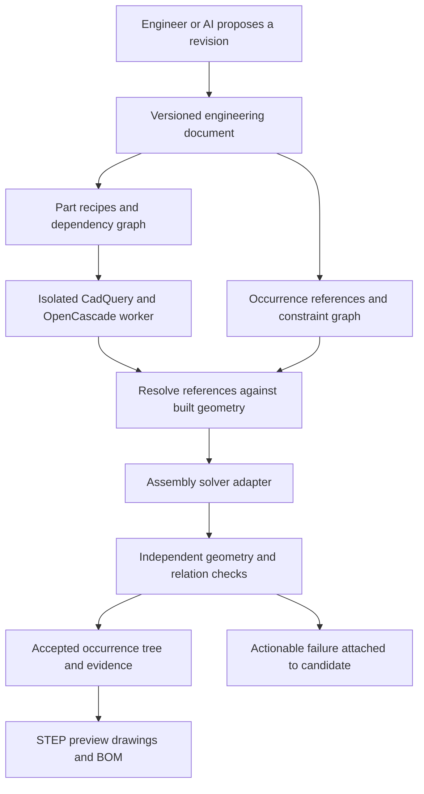

# Forma engineering architecture: local evidence and proposed plan

Reviewed on 2026-10-01. This is a recommendation based on the current source and local experiments, not an implemented architecture or a claim of CATIA/SOLIDWORKS equivalence.

## Decision

**Keep CadQuery/OpenCascade and Python. Strengthen the engineering document, assembly integration and independent validation before expanding the feature list.** Evaluate OndselSolver behind a separate adapter for mechanisms; it is not yet a selected or integrated production dependency.

The local tests demonstrate useful native geometry and static assembly capabilities. They also reproduce cases where solver success and valid STEP geometry do not establish a correct engineering assembly. Changing the orchestration language would not fix those cases.

The recommendation refines [the existing architecture proposal](../FORMA_AI_NATIVE_CAD_ARCHITECTURE.md). Python part recipes can remain editable and expressive. A versioned engineering document should record those recipes together with parameters, definitions, occurrences, reference contracts, joints, configurations and accepted evidence. This does **not** require implementing a geometry kernel or restricting the agent to a fixed catalog of mechanical products.

## What actually ran locally

The isolated environment was created from `runtimes/python/uv.lock` with `uv sync --locked --project runtimes/python --python 3.12`, using a separate `UV_PROJECT_ENVIRONMENT`. It uses Python 3.12.14, CadQuery 2.8.0, cadquery-ocp 7.9.3.1.1, CasADi 3.6.7, NLopt 2.11.0 and VTK 9.6.2 on Windows 11.

Each reviewed fixture ran in a fresh child process with a timeout, a credential-free environment allowlist, and recorded exit code, elapsed time and peak working set. This is process separation, not an OS security sandbox. No customer-generated code, model calls, hosted publication, product changes or deployments were involved. These Windows results do not attest the contents or behavior of Forma's hosted Linux snapshot.

The initial hosted probe failed at sandbox creation with HTTP 403; no CAD test ran there. Its evidence remains in [FORMA_NATIVE_CAPABILITY_PROBE.json](FORMA_NATIVE_CAPABILITY_PROBE.json).

Local measurements and prior attempts are saved in [FORMA_LOCAL_ENGINE_TEST_RESULTS.json](FORMA_LOCAL_ENGINE_TEST_RESULTS.json). The reproducible harness is [audit_native_cad.py](../scripts/audit_native_cad.py).

| Test | Measured result | What it establishes |
|---|---|---|
| B-spline surface | Four degree-three patch variants were valid; STEP area disagreement was at most 6.82e-13 mm² | Native creation, parameter changes and exchange work for this patch |
| Rational NURBS | Converted a full sphere to rational B-spline geometry; 441 samples after STEP import had maximum radius error 3.48e-12 mm | Rational NURBS geometry exists under the hood |
| NURBS volume precision | Default volume was 0.0437% below the analytic sphere volume; explicit integration tolerance reduced absolute error to 6.44e-5 mm³ | Property calculation policy matters separately from geometric validity |
| Two-part static mate | Position residual below 1e-12 mm | CadQuery can solve this simple static relationship |
| Contradictory mates | Solver returned `Solve_Succeeded` with both parts fixed and an unmet 8 mm mate offset | **Solver success is not a constraint-satisfaction gate** |
| Incomplete constraint | Two initial poses satisfied position constraints but ended about 29.91° apart in rotation | Missing constraints can leave different valid poses; intended freedom needs explicit representation |
| Parameter edits | 50 thickness variants rebuilt and remated, maximum position residual 2e-15 mm | This code recipe handles these edits; persistent feature/reference editing remains unproved |
| Reference stability | After adding a hole, the last face changed from a plane to a cylinder; a directional top selector worked in this example | Face-list indices can silently change meaning; directional selectors do not solve general topological naming |
| Invalid fillet | Oversized fillet was rejected | Kernel failure needs a recoverable product workflow |
| 60-component static solve | Three simple part definitions, 60 occurrences, 119 constraints; solve 0.647 s, STEP export/import 0.099 s | Small static native benchmark, with every occurrence center independently checked |
| Forma nested 60-part pipeline | Six subassemblies, 60 leaves; build 0.207 s, validation/meshing/inspection 3.530 s; no inspection errors; STEP centers and preview positions matched the oracle | Existing Forma runtime handles this defined nested static assembly |
| Internal STEP/preview mismatch | Moving only the middle occurrence by 5 mm kept the outer bounds unchanged and passed validation | **Overall bounds do not prove internal placement agreement** |
| Outer-extent mismatch | Moving an outer part was rejected | Positive control confirms the existing bounds check works within its scope |
| Joint metadata | An unsupported joint record did not block direct runtime build or baseline validation | Runtime does not centrally execute or verify manifest joints; this was not an API contract test |
| Existing runtime suite | 18 tests passed in 27.16 s | Existing geometry, inspection and requirement checks continue to pass |
| OndselSolver | Current FreeCAD fork cloned at `4be80eef02a3486cda0d78f3ccbb308d207a9639`; CMake configuration could not link compiler checks because `kernel32.lib`/Windows SDK libraries are missing | Local mechanism execution remains **untested**, not a solver failure |

The static solve uses unary position/orientation constraints. The nested Forma fixture uses code-defined placements, one simple part definition repeated 60 times, and rotated groups. Neither test establishes 60 unique complex parts, closed-loop motion, contact, singularity handling or large imported assemblies. Timings are one local run, not service latency estimates or performance guarantees. Peak working set was approximately 333–380 MiB per CAD worker; the static 60-component process took 5.88 s including imports, solving, exchange and shutdown. A cold first surface process took 28.67 s, so the solver-only timing should not be used as interactive latency.

The first NURBS assertion used default volume integration; it failed, prompting separate geometry and adaptive property checks. The first 60-part fixture used an unsupported CadQuery argument form and was corrected. The first pytest collection failed because the harness omitted `USERPROFILE`; adding a task-local profile fixed collection. Prior attempts are retained rather than treated as product failures or hidden.

## Do we have surfaces and OndselSolver?

**Surfaces: yes at the native engine level, partially at the Forma product level.** CadQuery's pinned implementation exposes B-spline fitting and NURBS conversion, and the local tests exercised both. Forma's inspection code also recognizes B-spline surface types. A complete surfacing workflow still needs curve/control-point editing, trim/extend/fill operations, reference persistence, seam measurements and usable diagnostics. One accurate sphere or one valid patch does not establish automotive-quality surface design. [CadQuery 2.8.0 shape implementation](https://github.com/CadQuery/cadquery/blob/v2.8.0/cadquery/occ_impl/shapes.py).

**OndselSolver: no Forma integration today.** It is a C++ assembly and multibody dynamics candidate. FreeCAD's assembly code provides an existing integration example, but a standalone Forma adapter, packaging, occurrence/reference mapping and independent motion validation are still required. The local checkout's standalone `main()` contains developer-machine paths, so simply building that executable would not establish a usable service. The upstream mechanism smoke tests inspected here often end in `EXPECT_TRUE(true)`; running them would provide execution evidence, not quantitative engineering accuracy by itself. [FreeCAD/OndselSolver](https://github.com/FreeCAD/OndselSolver), [FreeCAD assembly integration](https://github.com/FreeCAD/FreeCAD/blob/main/src/Mod/Assembly/App/AssemblyObject.cpp).

## Why Python is not the main reliability boundary

Python describes construction steps and invokes compiled engines. OpenCascade stores and operates on precise boundary geometry; CadQuery's assembly optimizer uses CasADi/IPOPT. Its convergence status describes an optimization result. Our conflicting fixed-mate fixture shows that Forma must separately measure the residual of each declared engineering relation. [Pinned assembly solver implementation](https://github.com/CadQuery/cadquery/blob/v2.8.0/cadquery/occ_impl/solver.py), [assembly documentation](https://cadquery.readthedocs.io/en/latest/assy.html).

The brittleness comes from several distinct sources: ambiguous references after topology changes, ill-conditioned or incomplete constraint systems, invalid feature parameters, inconsistent representations, numerical property integration, and worker/runtime failures. These also need management in a C++ application. Python is suitable for automation and orchestration when failures are bounded and evidence is independently produced.

## Proposed architecture

Drawings and BOM in this diagram are target consumers, not newly implemented features. A failed candidate preserves the last accepted revision.

1. **Document and revision layer.** Store code recipes, parameters with units, material assignments, part definitions, occurrence IDs, reference contracts, joint definitions and configuration inputs. Separate part identity from each copy in an assembly. Preserve supported custom code extensions so the agent retains flexibility.
2. **Geometry worker.** Build the affected dependency graph with CadQuery/OCP. Enforce memory, time and output limits in production isolation. Record actual installed native versions and image identity. Cache by engine identity, source, parameters and all transitive inputs; copying a lockfile is not proof that its dependencies were installed.
3. **Reference resolution.** Resolve named features to geometry using construction provenance, operation history and geometric checks. Missing or ambiguous references must fail visibly. An arbitrary coordinate or a face index must not silently substitute for the intended face/axis. Reuse mature reference/document infrastructure where practical; do not assume a new JSON graph solves topological naming. [FreeCAD's description of the problem](https://github.com/FreeCAD/FreeCAD-documentation/blob/main/wiki/Topological_naming_problem.md).
4. **Assembly adapter.** Convert supported, typed relations to a solver. Every endpoint includes an occurrence ID and a local reference/frame. Distinguish unsupported, incomplete, contradictory, singular and successfully checked states. Static constraints can initially use CadQuery; mechanisms require a separately qualified engine. The part dependency graph should be acyclic; an assembly constraint graph may legitimately contain closed loops.
5. **Independent evidence.** Reopen exported geometry and measure each relevant relation against defined linear/angular tolerances. Record intended remaining degrees of freedom. Verify per-occurrence transforms, shape identity and rotations across accepted poses, STEP and preview. Use explicit property integration tolerances for mass/CG/inertia and interference quantities; tessellation tolerances are a separate policy.
6. **Outputs and engineering workflow.** Generate preview, exchange files and downstream BOM/drawings from the same accepted occurrence tree. Permit reviewable drafts with explicit unresolved findings, but provide a separate engineering release state that requires its declared checks. An AI review can explain findings; it must not override failed deterministic evidence.

Example: in a 60-part machine with repeated bearings, changing one shaft diameter rebuilds the shaft and affected reference geometry. The joint graph resolves each bearing occurrence against the new shaft axis. The solver updates permitted placements, and the checker measures alignment and clearance. Only the validated pose is used for STEP and preview. If a shaft face disappears or a bearing no longer fits, the candidate reports the exact unresolved reference/relation and keeps the previous accepted revision.

## Work in order, with measurable acceptance gates

| Priority | Proposed work | Required evidence before acceptance |
|---|---|---|
| P0 | Per-occurrence STEP/preview consistency | The reproduced 5 mm internal mismatch is rejected; nested transforms, repeated parts and rotations pass positive controls |
| P0 | Deterministic relation validation | The reproduced 8 mm contradictory mate is rejected; every supported relation reports residuals and units; unknown relations remain unverified |
| P0 | Explicit precision and runtime identity | Analytic curved-shape baselines pass configured mass-property tolerances; actual deployed binary/package versions are recorded and reproduce the fixtures |
| P1 | Central static assembly integration | Manifest relations produce the solved pose; grounding and intended freedom are explicit; repeated-definition occurrences are unambiguous |
| P1 | Durable editing and references | Dimension changes, added/removed holes, reordered features, save/reopen and suppressed features preserve intended references or fail explicitly; last-good revision remains available |
| P1 | Mechanism engine qualification | Build Ondsel in a complete toolchain, then independently check a hinge, slider and closed-loop four-bar at multiple poses; cover limits, dead-center states, impossible geometry and branch selection |
| P1 | Professional drawing/BOM baseline | One released assembly produces consistent orthographic/section views, dimensions, part numbers, quantities and revision-linked exports; imported engineering references are checked |
| P2 | Surface workflow qualification | Numeric boundary gap, tangent and curvature continuity measurements for declared seam requirements; edited/trimmed/sewn models survive STEP exchange and reference updates |
| P2 | Scale and organizational pilot | Representative 60 unique-part project, nested repeated hardware, several concurrent engineers, save/reopen recovery, cancellation, project isolation, revision audit and exchange with existing CAD |

A 60-part corpus should include brackets, bores, shafts, bearings, patterned hardware and at least one surface-rich part. Benchmark full regeneration, affected-part regeneration, placement solving, inspection and exchange separately. Add incompatible dimensions and deliberate missing references; success cases alone cannot establish trust. Larger-project limits and concurrency require independent measurements—the current pair inspection enumerates 1,770 pairs at 60 leaves and does not establish thousand-part scalability.

## Adoption position

These results support continued investment in Forma as an automation and complementary engineering platform. They do not support replacing CATIA/SOLIDWORKS for released mechanical designs today. Initial organizational pilots should use a bounded class of static parts and assemblies with reviewable evidence and checked exchange into the organization's established CAD/PDM workflow.

The first implementation should address the reproduced consistency and relation-validation gaps. Advanced motion and surfacing should follow qualified adapters and acceptance corpora. Broader feature, organizational and SaaS licensing research remains in [the capability comparison](FORMA_CAD_CAPABILITY_RESEARCH.md) and [the license review](FORMA_SAAS_LICENSE_REVIEW.md).
